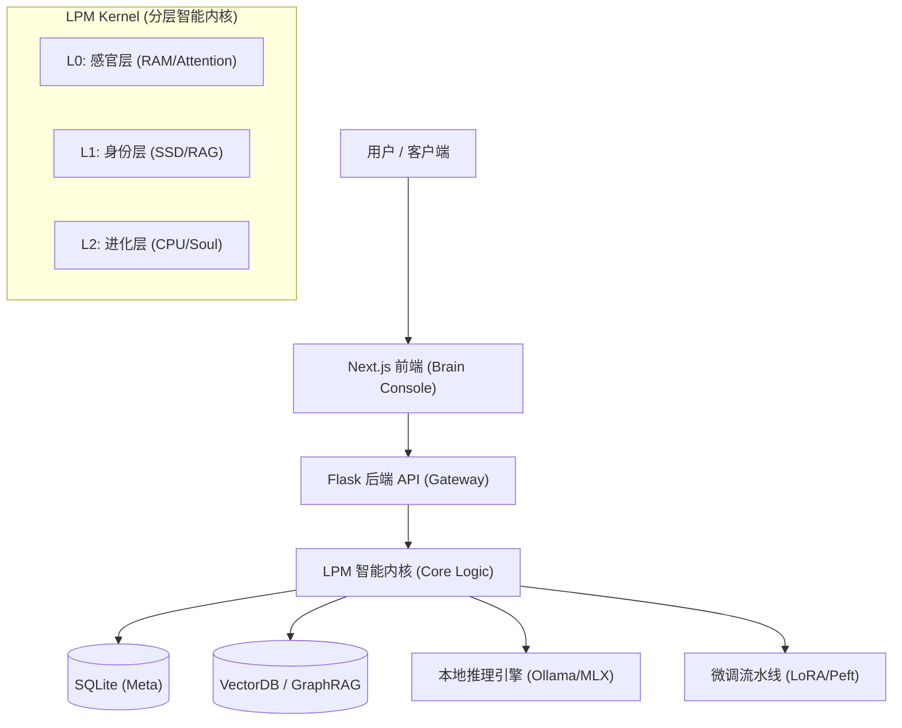
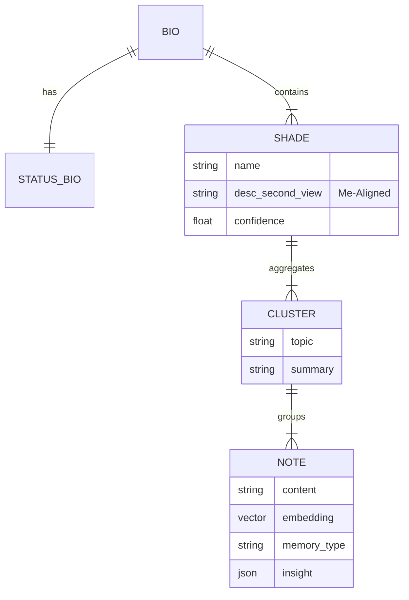
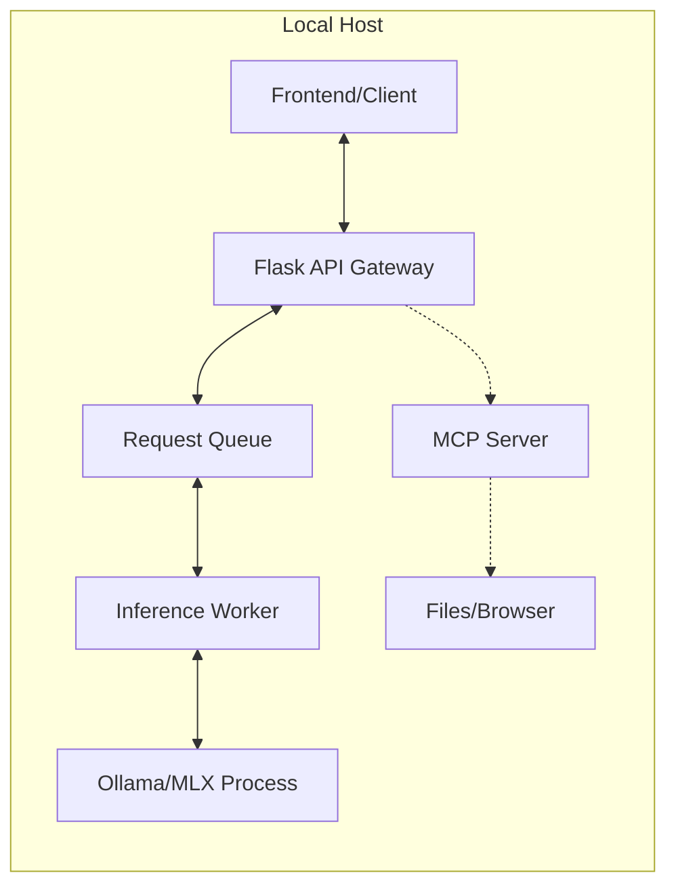
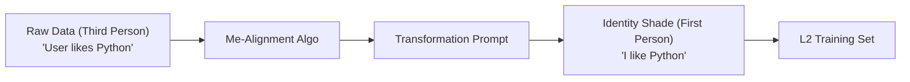
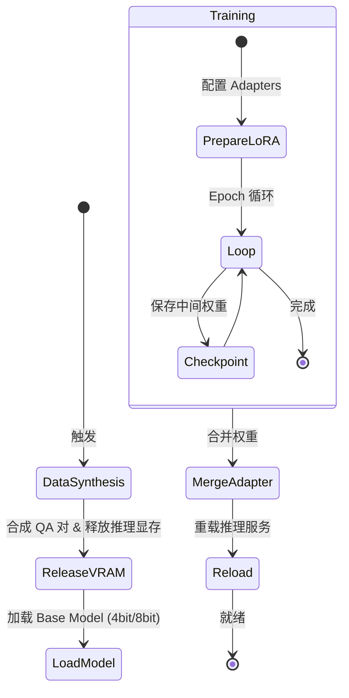
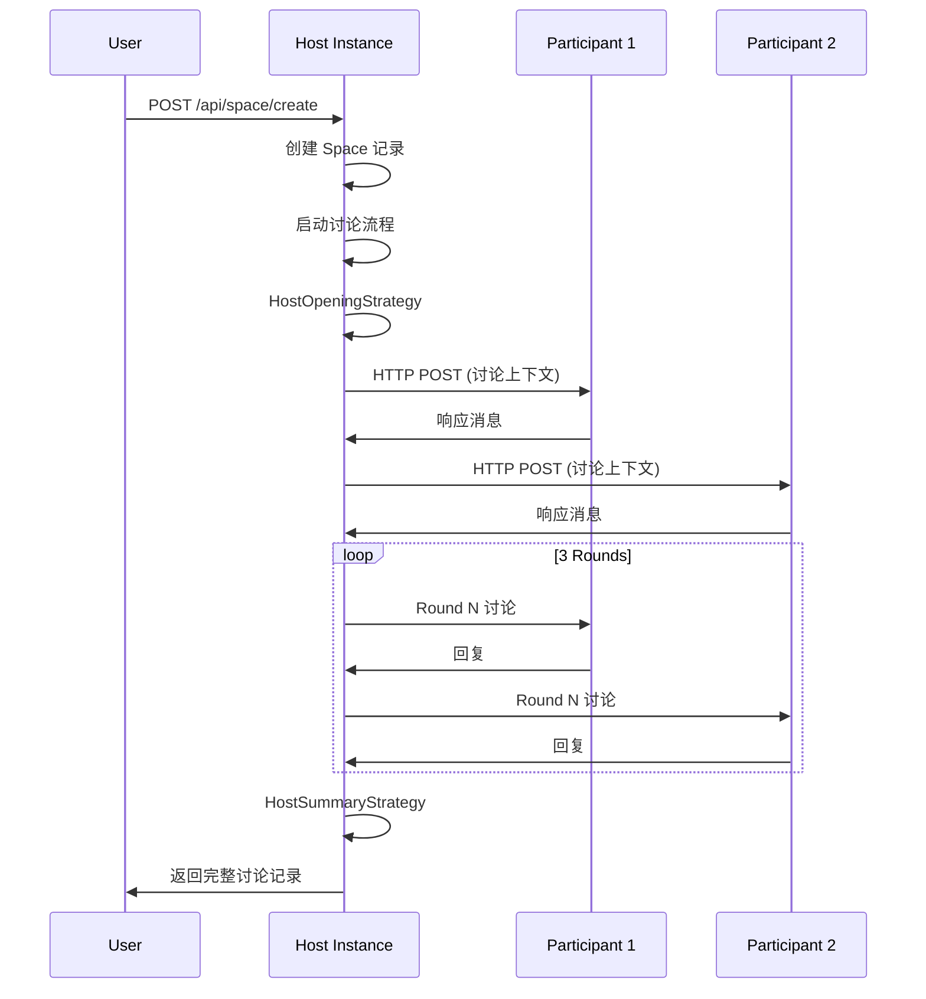

# Second Me 技术架构与实现指南

> **Version**: 2.0
> **Role**: Architect View
> **Status**: Living Document

## 1. 项目概述 (Executive Summary)

**Second Me** 是一个开源的 AI 原生记忆系统，旨在创建一个数字化的“AI 自我”。与传统的简单检索文档的 RAG（检索增强生成）系统不同，Second Me 构建了一个结构化且不断进化的身份模型。它利用 **分层记忆建模 (HMM)** 和 **自我对齐算法 (Me-Alignment)** 来捕捉用户的个性、上下文和思维模式，从而让 AI 能够像用户*一样*思考，而不仅仅是*为*用户思考。

---

## 2. 产品功能规格 (Product Specifications)

本章节定义了系统旨在解决的核心问题与交付的用户价值。

### 2.1 核心功能矩阵
| 功能模块 | 核心能力描述 | 用户价值 |
| :--- | :--- | :--- |
| **记忆胶囊 (Memory Capsule)** | 全模态摄入 (文本/图片/音频/链接)，自动生成情感化摘要与深度洞察。 | 消除碎片化信息的焦虑，将生活点滴转化为结构化、可检索的知识资产。 |
| **数字分身 (AI Avatar)** | 基于 RAG +微调的动态人格，随记忆增加而自动进化。 | 获得一个“懂你”的镜像伴侣，提供深度的共情与思维共鸣，而非机械问答。 |
| **思维可视化 (Mind Sphere)** | 3D 动态球体展示记忆节点的连接、激活与聚类状态。 | 将抽象的思维具象化，辅助用户发现知识盲区，激发跨领域的创意灵感。 |
| **专家协同 (Expert Mode)** | 动态召唤不同领域的 AI 专家 (如 Python 导师、写作顾问) 进入工作流。 | "一人即团队"，通过多智能体协作显著提升复杂问题的解决效率。 |
| **自我进化 (Evolution)** | 一键触发 L2 训练循环，将近期的高频记忆内化为模型的直觉。 | 让 AI 越用越聪明，且这种“聪明”是基于用户独特经验的完全定制。 |

### 2.2 典型使用场景 (Use Cases)
*   **个人知识库管理 (PKM)**: L0 生成摘要 -> L1 聚类主题 -> L2 习得偏好。用户询问技术方案时，AI 能调用过往经验给出符合用户风格的建议。
*   **情感陪伴与反思**: 结合多模态情感分析（视觉/文本），提供无评判的情绪价值，辅助用户进行深度的自我觉察。
*   **创意写作协同**: 利用 **DeepSeek R1** 的思维链能力结合用户阅读历史，提供符合用户审美趣味的情节发展建议。

---

## 3. 系统架构设计 (System Architecture)

系统遵循 **微内核 (Micro-Kernel)** 与 **本地优先 (Local-First)** 的架构原则。

### 3.1 总体架构图


### 3.2 技术栈选型 (Tech Stack)
*   **前端交互**: Next.js, TailwindCSS, React Context (负责状态流转)。
*   **后端服务**: Python, Flask (Blueprints 模块化), Pydantic (严格类型校验)。
*   **AI 基础设施**:
    *   **推理**: Ollama / llama.cpp (GGUF 适配消费级硬件)。
    *   **训练**: MLX (Apple Silicon 深度优化) / PyTorch (CUDA)。
    *   **协议**: Model Context Protocol (MCP) 实现工具与环境交互。

### 3.3 前端架构 (Visual Console)
前端被定义为可视化的“大脑控制台”，而非简单的 Chat UI。
*   **Network Sphere**: 3D 可视化组件，实时渲染记忆节点的激活路径。
*   **Thinking Modal**: 专门的模态窗口，展示 DeepSeek R1 等模型的隐藏思维链 (CoT)。

### 3.4 安全与隐私架构 (Security & Privacy)
*   **Local-First / Offline-Capable**: 数据（向量、权重、日志）全链路本地存储，支持断网运行。
*   **Privacy Guard**: 推理后处理层内置 PII 过滤器，防止敏感信息在展示层泄露。

---

## 4. LPM 智能内核详解 (LPM Kernel Design)

内核模仿人类大脑的运作机制，分为三个抽象层级。

### 4.1 L0: 感官与洞察层 (Sensory & Insight)
**隐喻**: **System RAM (Short-term Memory)**
*   **职责**: 处理高频交互，进行原始数据的清洗、分块与洞察提取。
*   **核心流程**: `L0Generator` 调用 Vision/Audio 模型将非结构化数据转化为结构化的 `DocumentDTO` (含摘要、关键词、情感标签)。

### 4.2 L1: 身份与结构层 (Identity & Structure)
**隐喻**: **SSD / Hard Drive (Long-term Memory)**
*   **职责**: 存储结构化事实与经历，构建身份骨架。
*   **数据结构**:
    *   `Note`: 记忆原子。
    *   `Cluster`: 语义聚类。
    *   `Shade`: 人格侧影 (如 "Python 专家", "科幻爱好者")。
    *   `Bio`: 全局传记。

**记忆实体关系图 (ER Diagram)**:


### 4.3 L2: 进化与合成层 (Evolution & Soul)
**隐喻**: **CPU Instruction Set (Intuition)**
*   **职责**: 将 L1 的显性知识内化为隐性的模型权重 (Weight)。
*   **特殊机制**: 不依赖检索，而是通过 **SFT + LoRA** 改变模型本身的反应模式。
*   **Deep Reasoning**: 集成 DeepSeek R1 逻辑，在训练数据中注入 `<think>` 标签，学习用户的思维方式。

---

## 5. 关键实现机制 (Key Implementation Mechanisms)

### 5.1 分层记忆建模 (HMM)
建立 **Raw Data -> Memory -> Cluster -> Shade -> Bio** 的金字塔结构。查询时自顶向下：先命中 Bio/Shade 确定上下文背景，再下钻到 Cluster/Memory 获取精准细节。

### 5.2 自我对齐算法 (Me-Alignment)
AI 产生“自我意识”的关键算法：
1.  **客观抽取**: 生成第三人称摘要。
2.  **视角转换**: 若 Prompt，将 "User..." 转换为 "I..."。
3.  **置信度加权**: 根据记忆出现的频率与时效性，动态调整 Shade 的 Confidence Level。

### 5.3 显著性过滤 (Saliency Filtering)
决定记忆能否从 L1 晋升 L2 的过滤器：
*   **情感强度**: 高情感浓度的记忆优先。
*   **高频复现**: 反复提及的概念被视为核心价值观。
*   **差异度 (Cosine Distance)**: 与现有画像差异大的新行为被标记为“人格演变”。

### 5.4 双路检索推理 (Dual-Retrieval Inference)
1.  **L1 通道 (Facts)**: 向量检索 "What/When/Where"。
2.  **L2 通道 (Vibe)**: 身份加载 "How/Why" (语气、态度)。
3.  **Synthesis**: 在 Prompt 中融合事实与人格。

---

## 6. 在线推理服务架构 (Online Inference Service)

基于 `lpm_kernel/api/domains/kernel2`，实现了复杂的 **上下文编排 (Context Orchestration)**。

### 6.1 执行流与时序
1.  **Query Analysis**: 解析用户意图。
2.  **Dual Retrieval**: 并行获取 L1 事实与 L2 设定。
3.  **Context Assembly (Augmented Prompt)**: 组装增强提示词。
4.  **Streaming Inference**: 调用 Ollama/MLX。

**高级对话 Prompt 策略流 (Strategy Chain)**:
```mermaid
graph TD
    Start[User Request] --> Strategy{Chat Strategy}
    
    Strategy -- Advanced Mode --> ReqEnhance[Requirement Enhancement<br/>(Clarify Intent)]
    ReqEnhance --> Expert[Expert Solution<br/>(Generate Draft)]
    Expert --> Validator{Validator<br/>(Is Solution Valid?)}
    
    Validator -- No --> Feedback[Critic Feedback]
    Feedback --> Expert
    
    Validator -- Yes --> Formatter[Solution Formatter<br/>(Style & Structure)]
    Formatter --> Response[Final Streaming Response]
    
    Strategy -- Normal Mode --> Retrieval[Knowledge Retrieval]
    Retrieval --> Role[Role Injection]
    Role --> Response
```

### 6.2 部署策略
*   **Concurrency Control**: 严格的 `Concurrency=1` 队列，防止本地 VRAM 溢出。
*   **MCP Integration**: 作为 LLM 与 OS 文件的中间层。

**推理服务部署拓扑**:


---

## 7. 核心提示词工程 (Prompt Engineering Strategy)

系统通过精细化的 System Prompts 控制 AI 的认知边界。

**Me-Alignment 视角转换流程**:


| 层级 | 关键 Prompt | 作用 |
| :--- | :--- | :--- |
| **L0** | `insight_image_overview` | 扮演“老朋友”生成图片标题，建立情感连接。 |
| **L1** | `COMMON_PERSPECTIVE_SHIFT` | 执行第三人称到第一人称的转换，实现“自我化”。 |
| **L1** | `SHADE_MERGE_PROMPT` | 引导 AI 发现并合并相似的兴趣领域。 |
| **L2** | `CONTEXT_COT_PROMPT` | 在合成数据中注入 `<think>` 标签，训练推理能力。 |
| **Chat** | `RequirementEnhancement` | 在高级对话中扮演“需求分析师”，澄清模糊意图。 |

---

## 8. 数据与训练架构 (Data & Training Pipeline)

### 8.1 数据模型 (Data Scehma)
*   **Note**: 基础原子 (Embedding + Content)。
*   **Cluster**: 语义聚合体。
*   **Shade**: 人格侧影 (Me-Aligned)。
*   **Bio**: 完整人格状态。

### 8.2 训练状态机 (Training FSM)


---

## 9. API 接口与工程结构 (Engineering Interface)

### 9.1 API 规范 (Flask Blueprints)

#### 9.1.1 核心 API 模块

| 模块 | 路由前缀 | 功能描述 | 主要端点 |
| :--- | :--- | :--- | :--- |
| **Health** | `/api/health` | 健康检查与系统状态 | `GET /health` |
| **Upload** | `/api/upload` | 多模态上传入口 | `POST /register` |
| **Documents** | `/api/documents` | L0 洞察触发与管理 | `GET /list`, `POST /scan` |
| **Memories** | `/api/memories` | L1 向量检索与聚类视图 | `POST /upload` |
| **Kernel** | `/api/kernel` | L1 生成与版本管理 | `POST /generate`, `GET /versions` |
| **Kernel2** | `/api/kernel2` | L2 训练控制与对话服务 | `POST /chat`, `GET /health`, `POST /train/start` |
| **Talk** | `/api/talk` | 实时对话 (Stream/JSON) | `POST /chat`, `POST /chat/json` |
| **Space** | `/api/space` | 多智能体协作空间 | `POST /create`, `GET /<space_id>` |
| **Roles** | `/api/kernel2/roles` | 角色定义与管理 | `POST /create`, `GET /all` |
| **TrainProcess** | `/api/trainprocess` | 训练流程控制 | `POST /start`, `GET /progress/<id>` |
| **Loads** | `/api/loads` | 个人负载管理 | `POST /create`, `GET /current` |
| **UserLLMConfig** | `/api/user_llm_config` | LLM 配置管理 | `POST /validate`, `GET /available` |

#### 9.1.2 API 设计原则

*   **RESTful 风格**: 遵循 REST 规范，使用标准 HTTP 方法。
*   **统一响应格式**: 所有 API 返回 `APIResponse` 包装结构：
    ```python
    {
        "code": 0,  # 0 表示成功，非 0 表示错误
        "message": "Success",
        "data": {...}
    }
    ```
*   **流式响应**: 对话接口支持 Server-Sent Events (SSE) 流式输出。
*   **DTO 验证**: 使用 Pydantic 进行请求参数校验。

#### 9.1.3 关键 API 端点详解

**对话接口 (`/api/kernel2/chat`)**:
```python
POST /api/kernel2/chat
Content-Type: application/json
Accept: text/event-stream

Request:
{
    "messages": [{"role": "user", "content": "..."}],
    "metadata": {
        "enable_l0_retrieval": true,
        "enable_l1_retrieval": true
    },
    "temperature": 0.7,
    "stream": true
}

Response (SSE):
data: {"choices": [{"delta": {"content": "..."}}]}
...
data: [DONE]
```

**Space 创建接口 (`/api/space/create`)**:
```python
POST /api/space/create
{
    "title": "讨论主题",
    "objective": "讨论目标",
    "host": "http://localhost:8002",
    "participants": ["http://other-instance:8002"]
}
```

### 9.2 数据模型与数据库 Schema

#### 9.2.1 核心数据表

**Document (文档表)**:
```sql
CREATE TABLE document (
    id INTEGER PRIMARY KEY,
    name VARCHAR(255),
    title VARCHAR(511),
    extract_status TEXT CHECK(...) DEFAULT 'INITIALIZED',
    embedding_status TEXT CHECK(...) DEFAULT 'INITIALIZED',
    analyze_status TEXT CHECK(...) DEFAULT 'INITIALIZED',
    mime_type VARCHAR(50),
    raw_content TEXT,
    insight TEXT,  -- JSON
    summary TEXT,  -- JSON
    keywords TEXT,
    create_time TIMESTAMP DEFAULT CURRENT_TIMESTAMP
);
```

**Chunk (文档块表)**:
```sql
CREATE TABLE chunk (
    id INTEGER PRIMARY KEY,
    document_id INTEGER REFERENCES document(id),
    content TEXT NOT NULL,
    has_embedding BOOLEAN DEFAULT 0,
    tags TEXT,  -- JSON
    topic VARCHAR(255)
);
```

**L1 版本化数据表**:
*   `l1_versions`: L1 生成版本管理
*   `l1_bios`: 全局传记 (含 third_view 和 second_view)
*   `l1_shades`: 人格侧影 (含 Me-Aligned 描述)
*   `l1_clusters`: 语义聚类结果
*   `l1_chunk_topics`: 文档块主题标签

**Status Biography (状态传记表)**:
```sql
CREATE TABLE status_biography (
    id INTEGER PRIMARY KEY,
    content TEXT NOT NULL,
    content_third_view TEXT NOT NULL,
    summary TEXT NOT NULL,
    summary_third_view TEXT NOT NULL,
    create_time TIMESTAMP DEFAULT CURRENT_TIMESTAMP
);
```

**Space (协作空间表)**:
```sql
CREATE TABLE spaces (
    id VARCHAR(255) PRIMARY KEY,
    title VARCHAR(255) NOT NULL,
    objective TEXT NOT NULL,
    participants TEXT NOT NULL,  -- JSON array
    host VARCHAR(255) NOT NULL,
    status INTEGER DEFAULT 1,
    conclusion TEXT,
    create_time TIMESTAMP DEFAULT CURRENT_TIMESTAMP
);
```

**Roles (角色表)**:
```sql
CREATE TABLE roles (
    id INTEGER PRIMARY KEY,
    uuid VARCHAR(64) UNIQUE,
    name VARCHAR(100) UNIQUE,
    description VARCHAR(500),
    system_prompt TEXT NOT NULL,
    enable_l0_retrieval BOOLEAN DEFAULT 1,
    enable_l1_retrieval BOOLEAN DEFAULT 1
);
```

#### 9.2.2 向量数据库 (ChromaDB)

**集合 (Collections)**:
*   `documents`: 文档级向量存储
*   `document_chunks`: 文档块级向量存储

**配置**:
*   **距离度量**: Cosine Similarity (`hnsw:space: cosine`)
*   **维度**: 可配置 (默认 1536，支持 OpenAI/自定义 Embedding 模型)
*   **持久化**: 本地文件系统 (`CHROMA_PERSIST_DIRECTORY`)

**向量检索流程**:
1. 生成查询向量 (Query Embedding)
2. 调用 `collection.query(query_embeddings=[...], n_results=k)`
3. 返回 Top-K 相似文档/块，包含距离分数

### 9.3 项目目录结构

```bash
Second-Me/
├── docs/                      # 架构与设计文档
│   ├── TECHNICAL_DESIGN.md    # 技术架构文档 (本文档)
│   ├── Custom Model Config(Ollama).md
│   └── Embedding Model Switching.md
│
├── lpm_frontend/              # Next.js 可视化前端
│   ├── src/
│   │   ├── app/               # Next.js App Router
│   │   │   ├── dashboard/     # 仪表盘页面
│   │   │   │   ├── playground/chat/    # 对话界面
│   │   │   │   ├── train/training/      # 训练管理
│   │   │   │   └── applications/        # 应用管理
│   │   │   └── standalone/              # 独立页面
│   │   │       ├── space/[spaceId]/     # Space 详情页
│   │   │       └── role/[roleId]/       # 角色对话页
│   │   ├── components/        # React 组件库
│   │   │   ├── API_MCP/       # MCP 集成组件
│   │   │   └── ...
│   │   ├── hooks/              # React Hooks
│   │   │   └── useSSE.tsx     # SSE 流式响应 Hook
│   │   ├── service/            # API 服务层
│   │   ├── store/              # 状态管理 (Zustand)
│   │   └── utils/              # 工具函数
│   └── next.config.js          # Next.js 配置 (含 API Proxy)
│
├── lpm_kernel/                # Python 智能核心
│   ├── app.py                 # Flask 应用入口
│   │
│   ├── api/                   # API Gateway 层
│   │   ├── domains/           # 领域模块 (按功能划分)
│   │   │   ├── documents/     # 文档管理
│   │   │   ├── kernel/        # L1 生成
│   │   │   ├── kernel2/       # L2 训练与对话
│   │   │   │   ├── services/  # 业务逻辑服务
│   │   │   │   │   ├── chat_service.py
│   │   │   │   │   ├── advanced_chat_service.py
│   │   │   │   │   └── knowledge_service.py
│   │   │   │   └── routes_talk.py
│   │   │   ├── space/         # Space 多智能体协作
│   │   │   │   ├── strategies/    # 策略模式实现
│   │   │   │   └── services/      # 讨论服务
│   │   │   ├── trainprocess/  # 训练流程控制
│   │   │   └── upload/        # 文件上传
│   │   ├── common/            # 公共组件
│   │   │   └── responses.py   # 统一响应格式
│   │   └── services/         # 共享服务
│   │       ├── local_llm_service.py
│   │       └── expert_llm_service.py
│   │
│   ├── L0/                    # L0: 感官与洞察层
│   │   ├── l0_generator.py    # L0 生成器
│   │   ├── models.py          # L0 数据模型
│   │   └── prompt.py          # L0 Prompt 模板
│   │
│   ├── L1/                    # L1: 身份与结构层
│   │   ├── l1_generator.py    # L1 生成器
│   │   ├── bio.py             # Bio/Shade/Cluster 领域模型
│   │   ├── shade_generator.py # Shade 生成
│   │   └── topics_generator.py # 主题生成
│   │
│   ├── L2/                    # L2: 进化与合成层
│   │   ├── train.py           # 训练主程序
│   │   ├── data_pipeline/     # 数据合成流水线
│   │   ├── mlx_training/      # MLX 训练支持
│   │   ├── dpo/               # DPO 训练支持
│   │   └── merge_lora_weights.py
│   │
│   ├── file_data/             # 文档处理模块
│   │   ├── document_service.py
│   │   ├── embedding_service.py
│   │   ├── chunker.py         # 文档分块
│   │   └── processors/        # 多模态处理器
│   │       ├── image_processor.py
│   │       ├── audio_processor.py
│   │       └── text_processor.py
│   │
│   ├── kernel/                # 内核服务层
│   │   ├── note_service.py   # Note 服务
│   │   ├── chunk_service.py  # Chunk 服务
│   │   └── l1/               # L1 管理
│   │
│   ├── common/                # 基础设施
│   │   ├── llm.py            # LLM 客户端封装
│   │   ├── repository/        # 数据访问层
│   │   │   ├── database_session.py
│   │   │   └── vector_repository.py
│   │   └── strategy/         # 策略模式基类
│   │
│   ├── configs/               # 配置管理
│   │   └── config.py          # 配置类 (单例模式)
│   │
│   └── database/              # 数据库迁移
│       └── migrations/
│
├── mcp/                       # MCP 协议集成
│   ├── mcp_local.py          # 本地 MCP 服务器
│   └── mcp_public.py         # 公共 MCP 服务器
│
├── docker/                    # 容器编排
│   ├── app/                   # 应用初始化脚本
│   └── sqlite/                # 数据库初始化
│       └── init.sql
│
├── resources/                 # 资源目录
│   ├── L1/                    # L1 生成结果
│   ├── L2/                    # L2 训练数据
│   └── model/                 # 模型文件
│
├── scripts/                   # 工程脚本
│   ├── start.sh              # 启动脚本
│   ├── setup.sh              # 环境设置
│   └── run_migrations.py     # 数据库迁移
│
├── docker-compose.yml         # Docker Compose 配置
├── Dockerfile.backend         # 后端 Dockerfile
├── Dockerfile.frontend        # 前端 Dockerfile
└── Makefile                   # 工程自动化脚本
```

---

## 10. 前端架构详解 (Frontend Architecture)

### 10.1 技术栈

*   **框架**: Next.js 14+ (App Router)
*   **UI 库**: Ant Design (antd)
*   **样式**: TailwindCSS
*   **状态管理**: Zustand
*   **HTTP 客户端**: Axios
*   **流式处理**: Server-Sent Events (SSE)

### 10.2 核心组件架构

**页面路由结构**:
```
/app
├── dashboard/              # 仪表盘 (需认证)
│   ├── playground/chat/    # 对话界面
│   ├── train/training/     # 训练管理
│   └── applications/       # 应用管理
└── standalone/             # 独立页面 (可分享)
    ├── space/[spaceId]/    # Space 详情页
    └── role/[roleId]/      # 角色对话页
```

**状态管理 (Zustand Stores)**:
*   `useLoadInfoStore`: 负载信息状态
*   `useChatStorage`: 对话会话存储 (LocalStorage)
*   `useSSE`: SSE 流式响应 Hook

### 10.3 API 代理配置

Next.js 通过 `rewrites` 将 `/api/*` 请求代理到后端:

```javascript
// next.config.js
async rewrites() {
    return [{
        source: '/api/:path*',
        destination: `${localApiBaseUrl}/api/:path*`
    }];
}
```

### 10.4 SSE 流式响应处理

**Hook 实现** (`useSSE.tsx`):
```typescript
const sendStreamMessage = async (request: ChatRequest) => {
    const response = await fetch('/api/kernel2/chat', {
        method: 'POST',
        headers: { 'Accept': 'text/event-stream' },
        body: JSON.stringify(request)
    });
    
    const reader = response.body?.getReader();
    const decoder = new TextDecoder();
    
    // 解析 SSE 流
    while (!done) {
        const { value } = await reader.read();
        const chunk = decoder.decode(value);
        // 解析 "data: {...}" 格式
    }
};
```

---

## 11. Space 多智能体协作机制 (Multi-Agent Collaboration)

### 11.1 架构设计

Space 是一个**去中心化的多智能体协作系统**，允许多个 Second Me 实例参与讨论。

**核心概念**:
*   **Host**: 讨论主持人，负责开场和总结
*   **Participants**: 参与者列表 (可包含外部实例)
*   **Round**: 讨论轮次 (固定 3 轮)
*   **Context Manager**: 上下文管理器，维护讨论状态

### 11.2 讨论流程



### 11.3 策略模式实现

**策略链 (Strategy Chain)**:
1. **HostOpeningStrategy**: 主持人开场，设定讨论目标
2. **ParticipantStrategy**: 参与者响应，基于上下文生成回复
3. **HostSummaryStrategy**: 主持人总结，生成讨论结论

**上下文管理**:
*   `SpaceContextManager`: 维护当前轮次、历史消息、讨论目标
*   每个策略通过 `context_manager` 获取上下文并更新状态

### 11.4 跨实例通信

**HTTP 调用协议**:
```python
POST {participant_endpoint}/api/kernel2/chat
{
    "messages": [
        {"role": "system", "content": "讨论上下文..."},
        {"role": "user", "content": "讨论问题"}
    ]
}
```

---

## 12. MCP 协议集成 (Model Context Protocol)

### 12.1 MCP 服务器实现

**本地 MCP 服务器** (`mcp/mcp_local.py`):
*   基于 `FastMCP` 框架
*   提供 `get_response` Tool，调用本地 Second Me API
*   支持 stdio 传输协议

**使用场景**:
*   作为 LLM 的工具调用接口
*   允许外部 LLM 通过 MCP 访问 Second Me 能力

### 12.2 MCP Tool 定义

```python
@mindv.tool()
async def get_response(query: str) -> str:
    """
    Received a response based on local secondme model.
    """
    # 调用 /api/kernel2/chat
    # 解析 SSE 流式响应
    # 返回完整内容
```

---

## 13. 配置管理系统 (Configuration Management)

### 13.1 配置类设计

**单例模式** (`Config`):
*   从 `.env` 文件加载配置
*   支持环境变量覆盖
*   提供类型安全的配置访问

**核心配置项**:
```python
@dataclass
class Config:
    app_name: str
    version: str
    database: DatabaseConfig
    CHROMA_PERSIST_DIRECTORY: str
    KERNEL2_SERVICE_URL: str
    REGISTRY_SERVICE_URL: str
    # ... 其他动态配置存储在 _extra_config
```

### 13.2 用户 LLM 配置

**配置表** (`user_llm_configs`):
*   **Chat 配置**: endpoint, api_key, model_name
*   **Embedding 配置**: endpoint, api_key, model_name
*   **Thinking 配置**: endpoint, api_key, model_name (用于 DeepSeek R1)

**动态切换**:
*   支持运行时切换 Embedding 模型
*   自动检测 Embedding 维度并重建 ChromaDB Collection

---

## 14. 部署架构 (Deployment Architecture)

### 14.1 Docker Compose 部署

**服务组成**:
```yaml
services:
  backend:
    build: Dockerfile.backend
    ports: ["8002:8002", "8080:8080"]
    volumes:
      - ./data:/app/data          # 数据持久化
      - ./resources:/app/resources
    environment:
      - LOCAL_APP_PORT=8002
      - IN_DOCKER_ENV=1
  
  frontend:
    build: Dockerfile.frontend
    ports: ["3000:3000"]
    depends_on: [backend]
```

**资源限制**:
*   Backend: 64GB 内存上限 (支持大模型推理)
*   Frontend: 2GB 内存上限

### 14.2 多平台支持

**Dockerfile 变体**:
*   `Dockerfile.backend`: 通用 Linux
*   `Dockerfile.backend.apple`: Apple Silicon 优化
*   `Dockerfile.backend.cuda`: CUDA GPU 支持

### 14.3 数据持久化

**Volume 挂载**:
*   `./data`: SQLite 数据库、ChromaDB、日志
*   `./resources`: 原始内容、训练数据、模型文件
*   `./logs`: 应用日志

---

## 15. 错误处理与日志系统 (Error Handling & Logging)

### 15.1 日志架构

**日志配置** (`configs/logging.py`):
*   **应用日志**: 标准 Python logging
*   **训练日志**: 独立的训练进程日志 (`get_train_process_logger`)
*   **日志级别**: DEBUG, INFO, WARNING, ERROR

**日志输出**:
*   控制台输出 (开发环境)
*   文件输出 (`logs/` 目录)
*   支持日志轮转

### 15.2 错误处理策略

**API 错误响应**:
```python
try:
    # 业务逻辑
    return APIResponse.success(data=result)
except ValidationError as e:
    return APIResponse.error(message=str(e), code=400)
except Exception as e:
    logger.error(f"Unexpected error: {str(e)}", exc_info=True)
    return APIResponse.error(message="Internal server error", code=500)
```

**训练流程错误**:
*   训练步骤失败时记录进度状态
*   支持断点续训 (通过进度 ID)

---

## 16. 性能优化策略 (Performance Optimization)

### 16.1 推理优化

**并发控制**:
*   **严格队列**: `Concurrency=1`，防止 VRAM 溢出
*   **请求队列**: 使用线程安全的队列管理请求

**模型加载优化**:
*   **量化**: 支持 4bit/8bit 量化 (QLoRA)
*   **延迟加载**: 仅在需要时加载模型
*   **显存释放**: 训练前主动释放推理模型显存

### 16.2 向量检索优化

**批量处理**:
*   文档 Embedding 批量生成
*   Chunk Embedding 批量存储

**索引优化**:
*   ChromaDB HNSW 索引自动优化
*   支持维度不匹配检测与自动重建

### 16.3 前端优化

**SSE 流式渲染**:
*   增量更新 UI，避免阻塞
*   使用 `useRef` 缓存流式内容

**API 代理缓存**:
*   Next.js 代理层缓存静态资源
*   禁用 API 响应缓存 (`Cache-Control: no-cache`)

---

## 17. 安全与隐私增强 (Security & Privacy Enhancements)

### 17.1 数据隔离

**多实例支持**:
*   每个 Second Me 实例独立数据库
*   通过 `instance_id` 和 `instance_password` 隔离

### 17.2 隐私保护

**PII 过滤** (规划中):
*   推理后处理层过滤敏感信息
*   支持自定义隐私规则

**本地优先**:
*   所有数据本地存储
*   支持完全离线运行

---

## 18. 扩展性设计 (Extensibility)

### 18.1 插件化架构

**策略模式**:
*   `BasePromptStrategy`: Prompt 构建策略基类
*   `SystemPromptStrategy`: System Prompt 注入策略
*   支持自定义策略链组合

**处理器工厂** (`process_factory.py`):
*   根据 MIME 类型动态选择处理器
*   支持扩展新的文件类型处理器

### 18.2 多后端支持

**LLM 客户端抽象** (`common/llm.py`):
*   统一的 LLM 调用接口
*   支持 Ollama、OpenAI、自定义端点

**向量数据库抽象** (`common/repository/vector_repository.py`):
*   `BaseVectorRepository` 抽象基类
*   当前实现: `ChromaRepository`
*   支持扩展其他向量数据库 (如 Milvus、Pinecone)

---

## 19. 未来规划 (Roadmap)

### 19.1 短期目标

*   **GraphRAG 集成**: 增强 L1 层的关系图谱能力
*   **DPO 训练支持**: 完善 L2 层的偏好对齐训练
*   **WebSocket 支持**: 替代 SSE 实现双向通信

### 19.2 中期目标

*   **分布式训练**: 支持多机分布式 L2 训练
*   **模型市场**: 共享与交易训练好的 L2 模型
*   **移动端支持**: React Native 移动应用

### 19.3 长期愿景

*   **联邦学习**: 跨实例的知识共享与协作
*   **多模态 L2**: 支持图像、音频的 L2 训练
*   **实时同步**: 多设备间的实时记忆同步

---

## 附录 A: 关键术语表 (Glossary)

| 术语 | 英文 | 定义 |
| :--- | :--- | :--- |
| **L0** | Layer 0 | 感官与洞察层，负责原始数据的处理与摘要生成 |
| **L1** | Layer 1 | 身份与结构层，负责记忆的聚类与人格侧影生成 |
| **L2** | Layer 2 | 进化与合成层，负责将显性知识内化为模型权重 |
| **HMM** | Hierarchical Memory Modeling | 分层记忆建模，构建金字塔式的记忆结构 |
| **Me-Alignment** | Me-Alignment | 自我对齐算法，实现第三人称到第一人称的视角转换 |
| **Shade** | Shade | 人格侧影，代表用户的某个兴趣领域或身份侧面 |
| **Bio** | Biography | 全局传记，用户的完整人格画像 |
| **Space** | Space | 多智能体协作空间，支持多个 Second Me 实例参与讨论 |
| **MCP** | Model Context Protocol | 模型上下文协议，用于 LLM 与工具/环境的交互 |
| **LoRA** | Low-Rank Adaptation | 低秩适应，高效的模型微调技术 |

---

## 附录 B: 参考资源 (References)

*   **项目仓库**: [GitHub Repository URL]
*   **文档站点**: [Documentation Site URL]
*   **社区论坛**: [Community Forum URL]

---

**文档维护**: 本文档随项目演进持续更新，建议定期查阅最新版本。
