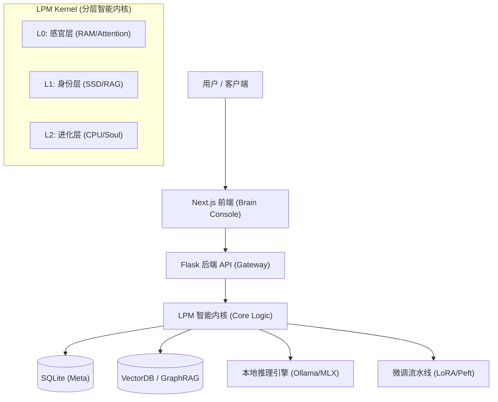
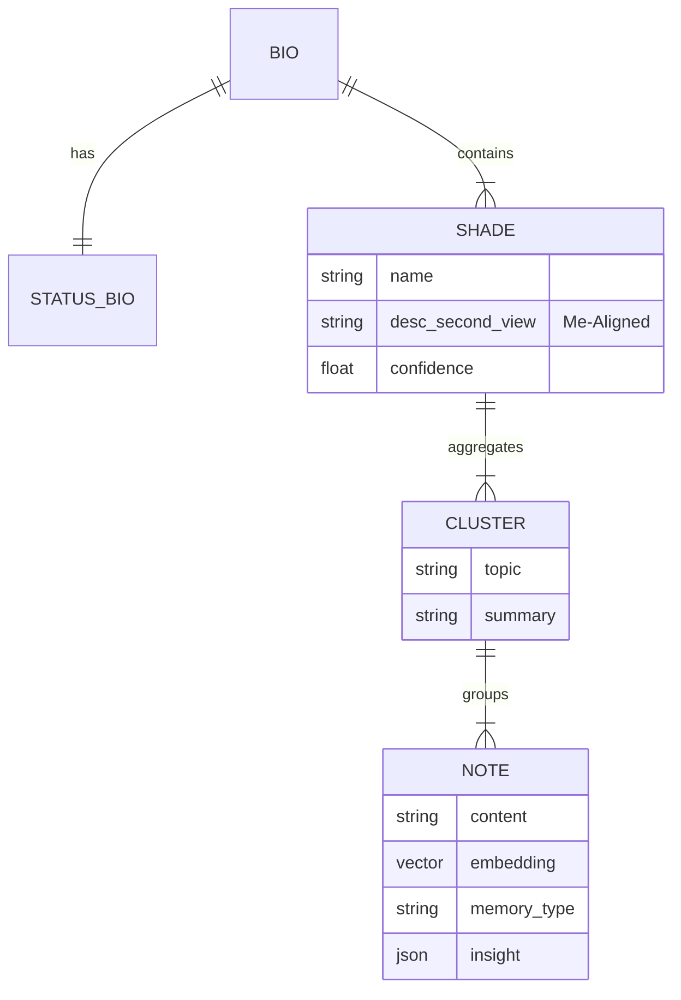
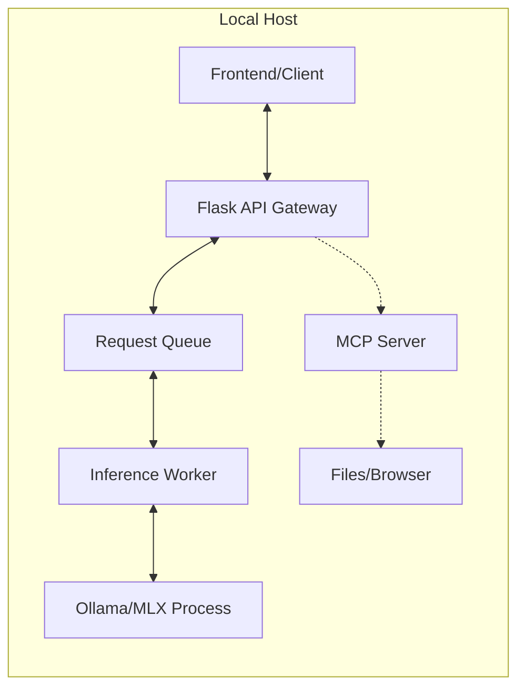
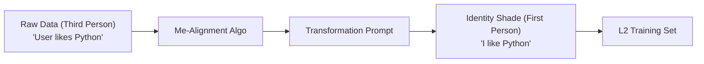
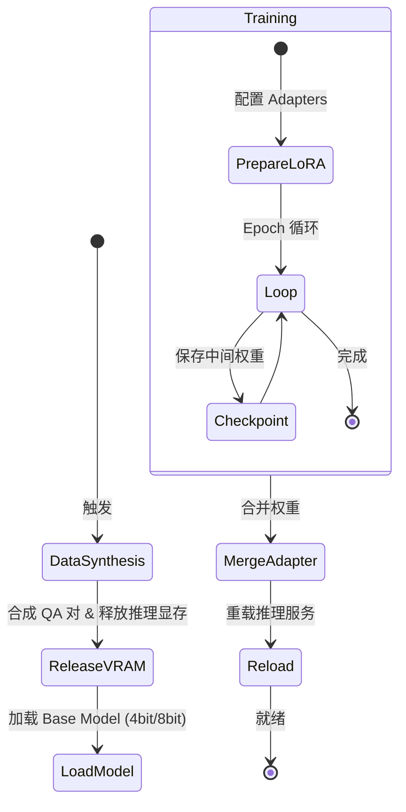

# Second Me 技术架构与实现指南

> **Version**: 2.0
> **Role**: Architect View
> **Status**: Living Document

## 1. 项目概述 (Executive Summary)

**Second Me** 是一个开源的 AI 原生记忆系统，旨在创建一个数字化的“AI 自我”。与传统的简单检索文档的 RAG（检索增强生成）系统不同，Second Me 构建了一个结构化且不断进化的身份模型。它利用 **分层记忆建模 (HMM)** 和 **自我对齐算法 (Me-Alignment)** 来捕捉用户的个性、上下文和思维模式，从而让 AI 能够像用户*一样*思考，而不仅仅是*为*用户思考。

---

## 2. 产品功能规格 (Product Specifications)

本章节定义了系统旨在解决的核心问题与交付的用户价值。

### 2.1 核心功能矩阵
| 功能模块 | 核心能力描述 | 用户价值 |
| :--- | :--- | :--- |
| **记忆胶囊 (Memory Capsule)** | 全模态摄入 (文本/图片/音频/链接)，自动生成情感化摘要与深度洞察。 | 消除碎片化信息的焦虑，将生活点滴转化为结构化、可检索的知识资产。 |
| **数字分身 (AI Avatar)** | 基于 RAG +微调的动态人格，随记忆增加而自动进化。 | 获得一个“懂你”的镜像伴侣，提供深度的共情与思维共鸣，而非机械问答。 |
| **思维可视化 (Mind Sphere)** | 3D 动态球体展示记忆节点的连接、激活与聚类状态。 | 将抽象的思维具象化，辅助用户发现知识盲区，激发跨领域的创意灵感。 |
| **专家协同 (Expert Mode)** | 动态召唤不同领域的 AI 专家 (如 Python 导师、写作顾问) 进入工作流。 | "一人即团队"，通过多智能体协作显著提升复杂问题的解决效率。 |
| **自我进化 (Evolution)** | 一键触发 L2 训练循环，将近期的高频记忆内化为模型的直觉。 | 让 AI 越用越聪明，且这种“聪明”是基于用户独特经验的完全定制。 |

### 2.2 典型使用场景 (Use Cases)
*   **个人知识库管理 (PKM)**: L0 生成摘要 -> L1 聚类主题 -> L2 习得偏好。用户询问技术方案时，AI 能调用过往经验给出符合用户风格的建议。
*   **情感陪伴与反思**: 结合多模态情感分析（视觉/文本），提供无评判的情绪价值，辅助用户进行深度的自我觉察。
*   **创意写作协同**: 利用 **DeepSeek R1** 的思维链能力结合用户阅读历史，提供符合用户审美趣味的情节发展建议。

---

## 3. 系统架构设计 (System Architecture)

系统遵循 **微内核 (Micro-Kernel)** 与 **本地优先 (Local-First)** 的架构原则。

### 3.1 总体架构图


### 3.2 技术栈选型 (Tech Stack)
*   **前端交互**: Next.js, TailwindCSS, React Context (负责状态流转)。
*   **后端服务**: Python, Flask (Blueprints 模块化), Pydantic (严格类型校验)。
*   **AI 基础设施**:
    *   **推理**: Ollama / llama.cpp (GGUF 适配消费级硬件)。
    *   **训练**: MLX (Apple Silicon 深度优化) / PyTorch (CUDA)。
    *   **协议**: Model Context Protocol (MCP) 实现工具与环境交互。

### 3.3 前端架构 (Visual Console)
前端被定义为可视化的“大脑控制台”，而非简单的 Chat UI。
*   **Network Sphere**: 3D 可视化组件，实时渲染记忆节点的激活路径。
*   **Thinking Modal**: 专门的模态窗口，展示 DeepSeek R1 等模型的隐藏思维链 (CoT)。

### 3.4 安全与隐私架构 (Security & Privacy)
*   **Local-First / Offline-Capable**: 数据（向量、权重、日志）全链路本地存储，支持断网运行。
*   **Privacy Guard**: 推理后处理层内置 PII 过滤器，防止敏感信息在展示层泄露。

---

## 4. LPM 智能内核详解 (LPM Kernel Design)

内核模仿人类大脑的运作机制，分为三个抽象层级。

### 4.1 L0: 感官与洞察层 (Sensory & Insight)
**隐喻**: **System RAM (Short-term Memory)**
*   **职责**: 处理高频交互，进行原始数据的清洗、分块与洞察提取。
*   **核心流程**: `L0Generator` 调用 Vision/Audio 模型将非结构化数据转化为结构化的 `DocumentDTO` (含摘要、关键词、情感标签)。

### 4.2 L1: 身份与结构层 (Identity & Structure)
**隐喻**: **SSD / Hard Drive (Long-term Memory)**
*   **职责**: 存储结构化事实与经历，构建身份骨架。
*   **数据结构**:
    *   `Note`: 记忆原子。
    *   `Cluster`: 语义聚类。
    *   `Shade`: 人格侧影 (如 "Python 专家", "科幻爱好者")。
    *   `Bio`: 全局传记。

**记忆实体关系图 (ER Diagram)**:


### 4.3 L2: 进化与合成层 (Evolution & Soul)
**隐喻**: **CPU Instruction Set (Intuition)**
*   **职责**: 将 L1 的显性知识内化为隐性的模型权重 (Weight)。
*   **特殊机制**: 不依赖检索，而是通过 **SFT + LoRA** 改变模型本身的反应模式。
*   **Deep Reasoning**: 集成 DeepSeek R1 逻辑，在训练数据中注入 `<think>` 标签，学习用户的思维方式。

---

## 5. 关键实现机制 (Key Implementation Mechanisms)

### 5.1 分层记忆建模 (HMM)
建立 **Raw Data -> Memory -> Cluster -> Shade -> Bio** 的金字塔结构。查询时自顶向下：先命中 Bio/Shade 确定上下文背景，再下钻到 Cluster/Memory 获取精准细节。

### 5.2 自我对齐算法 (Me-Alignment)
AI 产生“自我意识”的关键算法：
1.  **客观抽取**: 生成第三人称摘要。
2.  **视角转换**: 若 Prompt，将 "User..." 转换为 "I..."。
3.  **置信度加权**: 根据记忆出现的频率与时效性，动态调整 Shade 的 Confidence Level。

### 5.3 显著性过滤 (Saliency Filtering)
决定记忆能否从 L1 晋升 L2 的过滤器：
*   **情感强度**: 高情感浓度的记忆优先。
*   **高频复现**: 反复提及的概念被视为核心价值观。
*   **差异度 (Cosine Distance)**: 与现有画像差异大的新行为被标记为“人格演变”。

### 5.4 双路检索推理 (Dual-Retrieval Inference)
1.  **L1 通道 (Facts)**: 向量检索 "What/When/Where"。
2.  **L2 通道 (Vibe)**: 身份加载 "How/Why" (语气、态度)。
3.  **Synthesis**: 在 Prompt 中融合事实与人格。

---

## 6. 在线推理服务架构 (Online Inference Service)

基于 `lpm_kernel/api/domains/kernel2`，实现了复杂的 **上下文编排 (Context Orchestration)**。

### 6.1 执行流与时序
1.  **Query Analysis**: 解析用户意图。
2.  **Dual Retrieval**: 并行获取 L1 事实与 L2 设定。
3.  **Context Assembly (Augmented Prompt)**: 组装增强提示词。
4.  **Streaming Inference**: 调用 Ollama/MLX。

**高级对话 Prompt 策略流 (Strategy Chain)**:
```mermaid
graph TD
    Start[User Request] --> Strategy{Chat Strategy}
    
    Strategy -- Advanced Mode --> ReqEnhance[Requirement Enhancement<br/>(Clarify Intent)]
    ReqEnhance --> Expert[Expert Solution<br/>(Generate Draft)]
    Expert --> Validator{Validator<br/>(Is Solution Valid?)}
    
    Validator -- No --> Feedback[Critic Feedback]
    Feedback --> Expert
    
    Validator -- Yes --> Formatter[Solution Formatter<br/>(Style & Structure)]
    Formatter --> Response[Final Streaming Response]
    
    Strategy -- Normal Mode --> Retrieval[Knowledge Retrieval]
    Retrieval --> Role[Role Injection]
    Role --> Response
```

### 6.2 部署策略
*   **Concurrency Control**: 严格的 `Concurrency=1` 队列，防止本地 VRAM 溢出。
*   **MCP Integration**: 作为 LLM 与 OS 文件的中间层。

**推理服务部署拓扑**:


---

## 7. 核心提示词工程 (Prompt Engineering Strategy)

系统通过精细化的 System Prompts 控制 AI 的认知边界。

**Me-Alignment 视角转换流程**:


| 层级 | 关键 Prompt | 作用 |
| :--- | :--- | :--- |
| **L0** | `insight_image_overview` | 扮演“老朋友”生成图片标题，建立情感连接。 |
| **L1** | `COMMON_PERSPECTIVE_SHIFT` | 执行第三人称到第一人称的转换，实现“自我化”。 |
| **L1** | `SHADE_MERGE_PROMPT` | 引导 AI 发现并合并相似的兴趣领域。 |
| **L2** | `CONTEXT_COT_PROMPT` | 在合成数据中注入 `<think>` 标签，训练推理能力。 |
| **Chat** | `RequirementEnhancement` | 在高级对话中扮演“需求分析师”，澄清模糊意图。 |

---

## 8. 数据与训练架构 (Data & Training Pipeline)

### 8.1 数据模型 (Data Scehma)
*   **Note**: 基础原子 (Embedding + Content)。
*   **Cluster**: 语义聚合体。
*   **Shade**: 人格侧影 (Me-Aligned)。
*   **Bio**: 完整人格状态。

### 8.2 训练状态机 (Training FSM)


---

## 9. API 接口与工程结构 (Engineering Interface)

### 9.1 API 规范 (Flask Blueprints)
| 模块 | 路由前缀 | 功能描述 |
| :--- | :--- | :--- |
| **Upload** | `/upload` | 多模态上传入口。 |
| **Documents** | `/documents` | L0 洞察触发与管理。 |
| **Memories** | `/memories` | L1 向量检索与聚类视图。 |
| **Kernel2** | `/kernel2` | L2 训练控制 (Start/Stop/Status)。 |
| **Talk** | `/talk` | 实时对话 (Stream/JSON)。 |

### 9.2 项目目录
```bash
Second-Me/
├── docs/               # 架构与设计文档
├── lpm_frontend/       # Next.js 可视化前端
├── lpm_kernel/         # Python 智能核心
│   ├── api/            # API Gateway & DTOs
│   ├── L0/             # Perception Layer (Ingestion)
│   ├── L1/             # Memory Layer (Storage & Graph)
│   ├── L2/             # Evolution Layer (Training)
│   ├── common/         # Infrastructure (DB/Log)
│   └── app.py          # Entry Point
├── docker/             # 容器编排
└── Makefile            # 工程脚本
```
