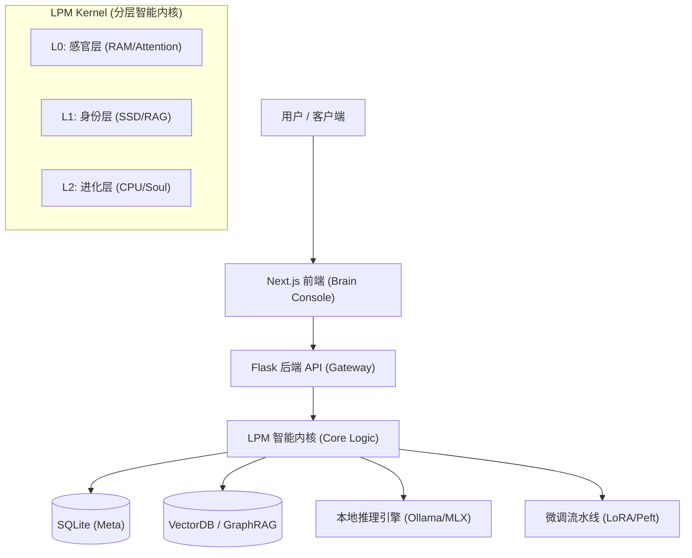
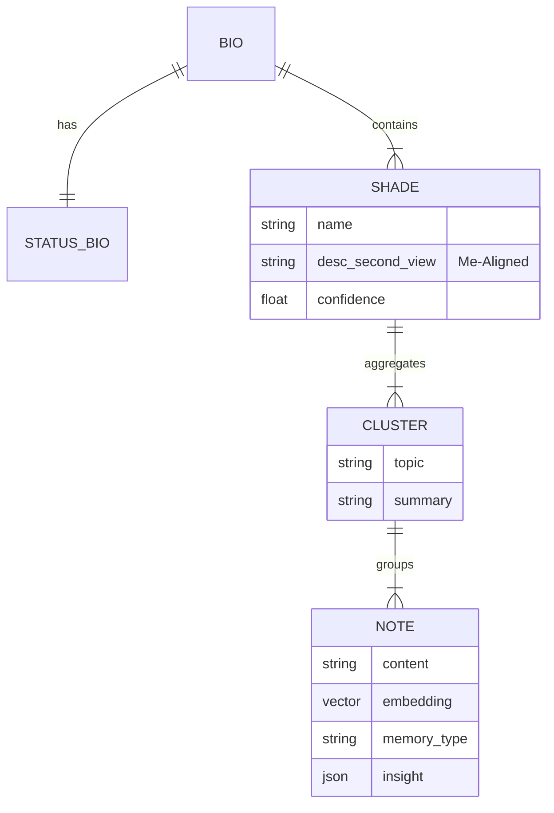
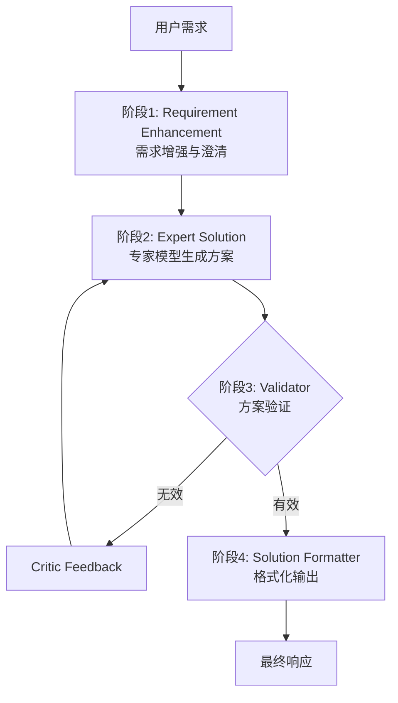
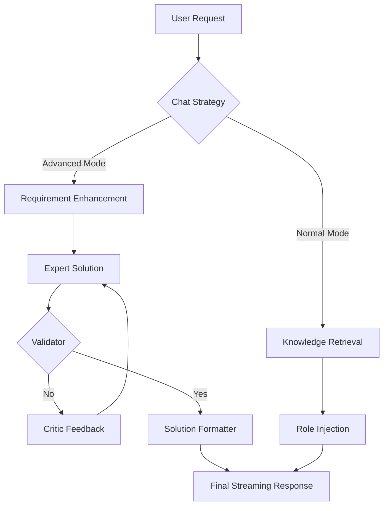
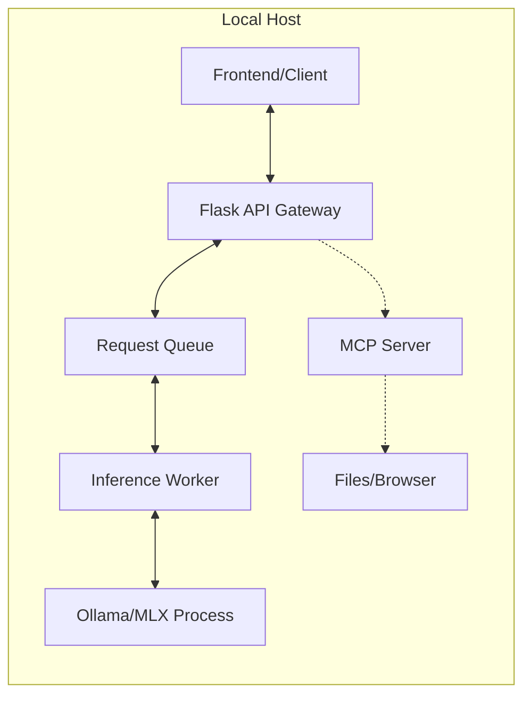
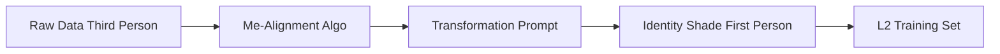
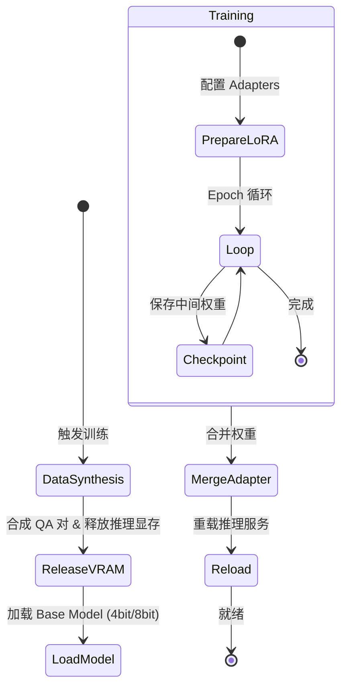
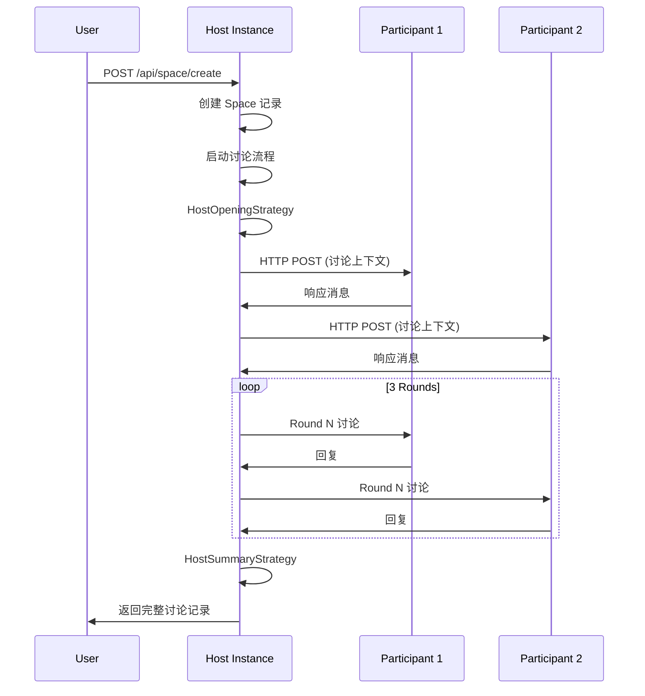

# Second Me 技术架构与实现指南

> **Version**: 2.0  
> **Role**: Architect View  
> **Status**: Living Document  
> **Last Updated**: 2024

## 目录 (Table of Contents)

1. [项目概述](#1-项目概述-executive-summary)
2. [产品功能规格](#2-产品功能规格-product-specifications)
3. [系统架构设计](#3-系统架构设计-system-architecture)
4. [LPM 智能内核详解](#4-lpm-智能内核详解-lpm-kernel-design)
5. [关键实现机制](#5-关键实现机制-key-implementation-mechanisms)
6. [在线推理服务架构](#6-在线推理服务架构-online-inference-service)
7. [核心提示词工程](#7-核心提示词工程-prompt-engineering-strategy)
8. [数据与训练架构](#8-数据与训练架构-data--training-pipeline)
9. [API 接口与工程结构](#9-api-接口与工程结构-engineering-interface)
10. [前端架构详解](#10-前端架构详解-frontend-architecture)
11. [Space 多智能体协作机制](#11-space-多智能体协作机制-multi-agent-collaboration)
12. [MCP 协议集成](#12-mcp-协议集成-model-context-protocol)
13. [配置管理系统](#13-配置管理系统-configuration-management)
14. [部署架构](#14-部署架构-deployment-architecture)
15. [错误处理与日志系统](#15-错误处理与日志系统-error-handling--logging)
16. [性能优化策略](#16-性能优化策略-performance-optimization)
17. [安全与隐私增强](#17-安全与隐私增强-security--privacy-enhancements)
18. [扩展性设计](#18-扩展性设计-extensibility)
19. [附录 A: 关键术语表](#附录-a-关键术语表-glossary)
20. [附录 B: 参考资源](#附录-b-参考资源-references)

---

## 1. 项目概述 (Executive Summary)

**Second Me** 是一个开源的 AI 原生记忆系统，旨在创建一个数字化的“AI 自我”。与传统的简单检索文档的 RAG（检索增强生成）系统不同，Second Me 构建了一个结构化且不断进化的身份模型。它利用 **分层记忆建模 (HMM)** 和 **自我对齐算法 (Me-Alignment)** 来捕捉用户的个性、上下文和思维模式，从而让 AI 能够像用户*一样*思考，而不仅仅是*为*用户思考。

---

## 2. 产品功能规格 (Product Specifications)

本章节定义了系统旨在解决的核心问题与交付的用户价值。

### 2.1 核心功能矩阵
| 功能模块 | 核心能力描述 | 用户价值 |
| :--- | :--- | :--- |
| **记忆胶囊 (Memory Capsule)** | 全模态摄入 (文本/图片/音频/链接)，自动生成情感化摘要与深度洞察。 | 消除碎片化信息的焦虑，将生活点滴转化为结构化、可检索的知识资产。 |
| **数字分身 (AI Avatar)** | 基于 RAG +微调的动态人格，随记忆增加而自动进化。 | 获得一个“懂你”的镜像伴侣，提供深度的共情与思维共鸣，而非机械问答。 |
| **思维可视化 (Mind Sphere)** | 3D 动态球体背景动画，提供沉浸式的视觉体验。当前使用演示数据，未来可接入真实记忆数据实现记忆节点的可视化。 | 增强界面的视觉吸引力，营造科技感的用户体验。 |
| **专家协同 (Expert Mode)** | 支持创建自定义角色（Role），每个角色可配置专属的 System Prompt 和知识检索策略。高级对话模式使用更强的模型进行多阶段处理。 | 通过角色定制和高级对话模式，提升复杂问题的解决质量。 |
| **自我进化 (Evolution)** | 一键触发 L2 训练循环，将近期的高频记忆内化为模型的直觉。 | 让 AI 越用越聪明，且这种“聪明”是基于用户独特经验的完全定制。 |

### 2.2 典型使用场景 (Use Cases)
*   **个人知识库管理 (PKM)**: L0 生成摘要 -> L1 聚类主题 -> L2 习得偏好。用户询问技术方案时，AI 能调用过往经验给出符合用户风格的建议。
*   **情感陪伴与反思**: 通过 L0 层的图片情感分类和情感化 Prompt 设计，提供温暖、共情的情绪价值，辅助用户进行深度的自我觉察。
*   **创意写作协同**: 利用 **DeepSeek R1** 的思维链能力（CoT）结合 L1 层的用户记忆检索，提供符合用户审美趣味的情节发展建议。

---

## 3. 系统架构设计 (System Architecture)

系统遵循 **微内核 (Micro-Kernel)** 与 **本地优先 (Local-First)** 的架构原则。

### 3.1 总体架构图


### 3.2 技术栈选型 (Tech Stack)
*   **前端交互**: Next.js, TailwindCSS, React Context (负责状态流转)。
*   **后端服务**: Python, Flask (Blueprints 模块化), Pydantic (严格类型校验)。
*   **AI 基础设施**:
    *   **推理**: Ollama / llama.cpp (GGUF 适配消费级硬件)。
    *   **训练**: MLX (Apple Silicon 深度优化) / PyTorch (CUDA)。
    *   **协议**: Model Context Protocol (MCP) 实现工具与环境交互。

### 3.3 前端架构 (Visual Console)
前端被定义为可视化的"大脑控制台"，而非简单的 Chat UI。
*   **Network Sphere**: 3D 背景动画组件，使用 Three.js 渲染动态球体网络效果。
    *   **当前实现**: 使用随机生成的演示数据（40 个节点），渲染动态球体网络动画作为首页背景。
    *   **未来规划**: 可接入真实的 L1 Cluster、Shade 等记忆数据，实现记忆节点的语义关系可视化。
*   **Thinking Model 配置**: 支持配置思维链模型（CoT），用于 L2 训练时的推理能力增强。

### 3.4 安全与隐私架构 (Security & Privacy)
*   **Local-First / Offline-Capable**: 数据（向量、权重、日志）全链路本地存储，支持断网运行。
*   **Privacy Guard**: 推理后处理层内置 PII 过滤器，防止敏感信息在展示层泄露。

---

## 4. LPM 智能内核详解 (LPM Kernel Design)

内核模仿人类大脑的运作机制，分为三个抽象层级。

### 4.1 L0: 感官与洞察层 (Sensory & Insight)
**隐喻**: **System RAM (Short-term Memory)**
*   **职责**: 处理高频交互，进行原始数据的清洗、分块与洞察提取。
*   **核心流程**: `L0Generator` 调用 Vision/Audio 模型将非结构化数据转化为结构化的 `DocumentDTO` (含摘要、关键词、情感标签)。

### 4.2 L1: 身份与结构层 (Identity & Structure)
**隐喻**: **SSD / Hard Drive (Long-term Memory)**
*   **职责**: 存储结构化事实与经历，构建身份骨架。
*   **数据结构**:
    *   `Note`: 记忆原子。
    *   `Cluster`: 语义聚类。
    *   `Shade`: 人格侧影 (如 "Python 专家", "科幻爱好者")。
    *   `Bio`: 全局传记。

**记忆实体关系图 (ER Diagram)**:


### 4.3 L2: 进化与合成层 (Evolution & Soul)
**隐喻**: **CPU Instruction Set (Intuition)**
*   **职责**: 将 L1 的显性知识内化为隐性的模型权重 (Weight)。
*   **特殊机制**: 不依赖检索，而是通过 **SFT + LoRA** 改变模型本身的反应模式。
*   **Deep Reasoning**: 集成 DeepSeek R1 逻辑，在训练数据中注入 `<think>` 标签，学习用户的思维方式。

---

## 5. 关键实现机制 (Key Implementation Mechanisms)

### 5.1 分层记忆建模 (HMM)
建立 **Raw Data -> Memory -> Cluster -> Shade -> Bio** 的金字塔结构。查询时自顶向下：先命中 Bio/Shade 确定上下文背景，再下钻到 Cluster/Memory 获取精准细节。

### 5.2 自我对齐算法 (Me-Alignment)
AI 产生“自我意识”的关键算法：
1.  **客观抽取**: 生成第三人称摘要。
2.  **视角转换**: 若 Prompt，将 "User..." 转换为 "I..."。
3.  **置信度加权**: 根据记忆出现的频率与时效性，动态调整 Shade 的 Confidence Level。

### 5.3 显著性过滤 (Saliency Filtering)
决定记忆能否从 L1 晋升 L2 的过滤器：
*   **情感强度**: 高情感浓度的记忆优先。
*   **高频复现**: 反复提及的概念被视为核心价值观。
*   **差异度 (Cosine Distance)**: 与现有画像差异大的新行为被标记为“人格演变”。

### 5.4 双路检索推理 (Dual-Retrieval Inference)
1.  **L1 通道 (Facts)**: 向量检索 "What/When/Where"。
2.  **L2 通道 (Vibe)**: 身份加载 "How/Why" (语气、态度)。
3.  **Synthesis**: 在 Prompt 中融合事实与人格。

### 5.5 专家协同机制 (Expert Mode)

专家协同功能包含两个核心组件：**角色系统 (Role System)** 和 **高级对话模式 (Advanced Chat Mode)**。

#### 5.5.1 角色系统 (Role System)

**数据模型**:
```python
class Role:
    uuid: str              # 角色唯一标识
    name: str              # 角色名称（如 "Python 导师"）
    description: str       # 角色描述
    system_prompt: str     # 专属的 System Prompt
    icon: str             # 角色图标
    enable_l0_retrieval: bool  # 是否启用 L0 知识检索
    enable_l1_retrieval: bool  # 是否启用 L1 知识检索
```

**实现机制**:
1. **角色创建**: 通过 `POST /api/kernel2/roles` 创建角色，存储到数据库 `roles` 表。
2. **角色应用**: 在对话请求的 `metadata.role_id` 中指定角色 UUID。
3. **Prompt 构建**: `RoleBasedStrategy` 根据 `role_id` 加载对应的 `system_prompt`，替换默认的 System Prompt。
4. **知识检索控制**: 根据角色的 `enable_l0_retrieval` 和 `enable_l1_retrieval` 配置，动态启用/禁用知识检索。

**策略链 (Strategy Chain)**:
```python
# 默认策略链
[BasePromptStrategy, RoleBasedStrategy, KnowledgeEnhancedStrategy]

# RoleBasedStrategy 工作流程
if role_id in metadata:
    role = role_service.get_role_by_uuid(role_id)
    system_prompt = role.system_prompt  # 使用角色的专属 Prompt
    enable_l0 = role.enable_l0_retrieval
    enable_l1 = role.enable_l1_retrieval
```

#### 5.5.2 高级对话模式 (Advanced Chat Mode)

**多阶段处理流程**:


**实现细节**:
1. **需求增强阶段**: 
   - 使用 `RequirementEnhancementStrategy` 构建 Prompt
   - 调用本地模型 (`local_llm_service`) 进行需求澄清
   - 集成 L0/L1 知识检索结果

2. **专家方案生成**:
   - 使用 `ExpertSolutionStrategy` 构建 Prompt
   - 调用专家模型 (`expert_llm_service`) 生成解决方案
   - 专家模型通过 `UserLLMConfigService` 配置，通常使用更强的模型（如 GPT-4、Claude 等）

   **实现流程**:
   ```python
   # 1. 构建 ChatRequest
   chat_request = ChatRequest(
       message=enhanced_requirement,  # 使用增强后的需求
       system_prompt="",  # 由策略设置
       temperature=temperature
   )
   
   # 2. 调用 chat_service，传入 expert_llm_service.client
   response = chat_service.chat(
       request=chat_request,
       strategy_chain=[BasePromptStrategy, ExpertSolutionStrategy],
       stream=False,
       json_response=False,
       client=expert_llm_service.client  # 关键：使用专家模型的客户端
   )
   
   # 3. chat_service 内部处理
   # - 使用 ExpertSolutionStrategy 构建 System Prompt:
   #   "You are an expert system designed to generate solutions..."
   # - 使用 expert_llm_service.client 而非默认的 local_llm_service.client
   # - expert_llm_service.client 通过 UserLLMConfigService 获取配置：
   #   * chat_endpoint: 专家模型的 API 端点
   #   * chat_api_key: 专家模型的 API Key
   #   * chat_model_name: 专家模型名称（如 "gpt-4", "claude-3-opus"）
   # - 调用 OpenAI 兼容的 API: client.chat.completions.create()
   
   # 4. 返回生成的解决方案
   solution = response.choices[0].message.content
   ```

   **关键实现点**:
   - **客户端切换**: `chat_service.chat()` 方法接受可选的 `client` 参数，当传入 `expert_llm_service.client` 时，会使用专家模型而非本地模型
   - **配置管理**: `ExpertLLMService` 通过 `UserLLMConfigService.get_available_llm()` 获取用户配置的专家模型信息
   - **模型参数**: 专家模型使用独立的配置（endpoint、api_key、model_name），与本地模型配置分离
   - **Prompt 策略**: `ExpertSolutionStrategy` 构建专门的专家级 System Prompt，强调生成详细、可实施的解决方案

3. **方案验证与迭代**:
   - 使用 `SolutionValidatorStrategy` 验证方案
   - 返回 JSON 格式：`{"is_valid": bool, "feedback": str}`
   - 如果无效，根据反馈重新生成（最多 `max_iterations` 次）

   **验证实现流程**:
   ```python
   # 1. 构建验证请求，包含原始需求和生成的方案
   chat_request = ChatRequest(
       message=f"""
       Requirement:
       {requirement}
       
       Solution:
       {solution}
       """,
       system_prompt="",  # 由 SolutionValidatorStrategy 设置
       temperature=0.2  # 较低温度保证验证结果的一致性
   )
   
   # 2. 调用 chat_service，使用 SolutionValidatorStrategy
   response = chat_service.chat(
       request=chat_request,
       strategy_chain=[BasePromptStrategy, SolutionValidatorStrategy],
       stream=False,
       json_response=False  # 注意：这里不使用 json_response=True
       # 因为 LLM 可能返回带格式的 JSON，需要手动解析
   )
   
   # 3. SolutionValidatorStrategy 构建的 System Prompt:
   """
   You are a solution validator. Your task is to validate if the given 
   solution meets all requirements.
   You must return a JSON response in the following format:
   {
       "is_valid": boolean,
       "feedback": string  // Reason and improvement suggestions if invalid
   }
   """
   
   # 4. 解析验证结果
   validation_text = response.choices[0].message.content
   try:
       validation_dict = json.loads(validation_text)
       validation_result = ValidationResult(
           is_valid=validation_dict["is_valid"],
           feedback=validation_dict.get("feedback")
       )
   except json.JSONDecodeError:
       # 如果解析失败，默认返回无效
       validation_result = ValidationResult(
           is_valid=False,
           feedback="Failed to validate solution"
       )
   ```

   **迭代优化流程**:
   ```python
   validation_history = []
   current_solution = initial_solution
   
   for iteration in range(max_iterations):  # 默认最多 3 次迭代
       # 验证当前方案
       validation_result = validate_solution(requirement, current_solution)
       validation_history.append(validation_result)
       
       if validation_result.is_valid:
           # 验证通过，进行格式化并退出循环
           final_format = format_solution(current_solution)
           break
       elif iteration < max_iterations - 1:
           # 验证未通过，根据反馈重新生成
           improved_requirement = f"""
           {requirement}
           
           Previous attempt feedback: {validation_result.feedback}
           """
           current_solution = generate_solution(
               improved_requirement, 
               temperature
           )
   ```

   **关键实现点**:
   - **验证 Prompt**: `SolutionValidatorStrategy` 构建专门的验证 Prompt，要求 LLM 以 JSON 格式返回验证结果
   - **温度控制**: 验证阶段使用较低温度 (0.2)，确保验证结果的一致性
   - **JSON 解析**: 手动解析 LLM 返回的 JSON，处理可能的格式问题
   - **迭代机制**: 如果验证失败，将反馈信息添加到需求中，重新调用专家模型生成改进方案
   - **历史记录**: 保存每次验证的结果到 `validation_history`，便于追踪优化过程
   - **退出条件**: 验证通过或达到最大迭代次数时退出循环

4. **最终格式化**:
   - 使用 `SolutionFormatterStrategy` 格式化输出
   - 提升可读性和结构

**API 端点**:
```python
POST /api/talk/advanced_chat
{
    "requirement": "用户需求描述",
    "max_iterations": 3,  # 最大迭代次数
    "temperature": 0.01,
    "enable_l0_retrieval": true,
    "enable_l1_retrieval": true
}
```

**专家模型配置**:
- 通过 `UserLLMConfigService` 管理专家模型配置
- 支持配置独立的 `chat_endpoint`、`chat_api_key`、`chat_model_name`
- `ExpertLLMService` 封装专家模型的调用逻辑

### 5.6 情感陪伴与反思机制 (Emotional Companion & Reflection)

**实现方式**: 通过 L0 层的多模态处理和情感化 Prompt 设计实现。

#### 5.6.1 图片情感分类

**实现流程**:
```python
# 1. 图片情感分类 (insight_image_parser)
# 使用 Vision 模型将图片分类为 "Emotion" 或 "Knowledge"
{
    "image": {
        "Step 1": "Summary of image content",
        "Step 2": "Emotional or informational analysis",
        "Step 3": "Emotion or Knowledge"  # 分类结果
    }
}

# 2. 情感化摘要生成 (insight_image_overview)
# Prompt 设计强调"老朋友"、"温暖"、"共情"、"幽默"
"""
You are an old friend of the user, who is good at summarizing images 
into caring, warm, and humorous insights, while providing emotional support.
you embody a warm, empathetic, and humorously intelligent personality...
"""

# 3. 情感化洞察生成 (insight_image_breakdown)
# 生成多个温暖、共情的洞察点
# 强调"情感连接"、"共同记忆"、"社区感"
```

**关键实现点**:
- **图片分类**: 使用 Vision 模型分析图片的情感元素（平静、舒适、怀旧、快乐等）
- **Prompt 工程**: 通过精心设计的 Prompt，让 LLM 扮演"老朋友"角色，提供情感支持
- **用户传记融合**: 在生成洞察时结合用户的传记信息（`about_me`、`global_bio`、`status_bio`），增强个性化
- **情感标签**: 图片被分类为 "Emotion" 类型时，会生成更注重情感连接的摘要

#### 5.6.2 文本情感分析

**当前实现**: 通过对话时的 L1 检索和角色设定，AI 能够理解用户的情绪状态并提供共情回应。

**实现机制**:
- 对话时启用 L1 检索，获取用户相关的记忆和经历
- 通过 `RoleBasedStrategy` 或默认的 System Prompt，设定 AI 为"理解用户的朋友"
- AI 基于用户的记忆和当前对话内容，提供无评判的情感支持

### 5.7 创意写作协同机制 (Creative Writing Collaboration)

**实现方式**: 结合 DeepSeek R1 的思维链能力和 L1 层的记忆检索。

#### 5.7.1 DeepSeek R1 思维链集成

**训练阶段集成**:
```python
# L2 训练时，如果启用 CoT (is_cot=True)
# CoT = Chain of Thought（思维链），是一种让 AI 展示推理过程的技术
# 通过要求模型输出思考步骤，提升推理质量和可解释性
# 使用 MEMORY_COT_PROMPT 生成训练数据

MEMORY_COT_PROMPT = """
You are {user_name}'s "Second Me"...
When thinking, follow these steps in order:
    1. Think about the relationship between the question and the background
    2. Derive the answer to the question
    3. Generate a high-quality response

Your output format:
<think>
As the thinking process of "Second Me", analyze {user_name}'s 
background information, historical records, and the questions...
</think>
<answer>
This is the final response to {user_name}...
</answer>
"""
```

**推理阶段使用**:
- 配置 `thinking_model_name`、`thinking_endpoint`、`thinking_api_key`
- 在对话时，如果启用 CoT，会调用 DeepSeek R1 模型
- 模型返回包含 `<think>` 标签的思维链输出

#### 5.7.2 用户阅读历史结合

**实现机制**:
- **L1 检索**: 当用户询问创意写作相关问题时，系统通过 L1 向量检索获取用户相关的记忆
- **记忆类型**: 包括用户阅读过的书籍、文章、笔记等（存储在 Document/Note 中）
- **Shade 识别**: 通过 L1 的 Shade（如"科幻爱好者"、"文学爱好者"）识别用户的审美偏好
- **个性化建议**: 结合检索到的阅读历史和用户的 Shade，生成符合用户审美趣味的情节建议

**实现流程**:
```python
# 1. 用户提问创意写作相关问题
user_query = "帮我构思一个科幻小说的情节"

# 2. L1 检索用户相关的阅读记忆
l1_knowledge = default_l1_retriever.retrieve(user_query)
# 返回: 用户阅读过的科幻作品、相关笔记、Shade 信息等

# 3. 构建增强的 Prompt
prompt = f"""
基于你对用户的了解：
- 用户阅读历史: {l1_knowledge}
- 用户兴趣领域: {user_shades}  # 如"科幻爱好者"

请提供符合用户审美趣味的情节发展建议。
"""

# 4. 如果启用 CoT，使用 DeepSeek R1 生成思维链
if is_cot:
    response = deepseek_r1_client.chat.completions.create(
        model="deepseek-r1",
        messages=[{"role": "user", "content": prompt}]
    )
    # 返回包含 <think> 的思维链输出
```

**关键实现点**:
- **记忆检索**: 通过 L1 向量检索获取用户阅读相关的记忆
- **Shade 应用**: 利用用户的 Shade（兴趣领域）识别审美偏好
- **思维链增强**: 使用 DeepSeek R1 的 CoT 能力，提供更深入的推理过程
- **个性化输出**: 结合用户的阅读历史和偏好，生成符合用户风格的建议

---

## 6. 在线推理服务架构 (Online Inference Service)

基于 `lpm_kernel/api/domains/kernel2`，实现了复杂的 **上下文编排 (Context Orchestration)**。

### 6.1 执行流与时序
1.  **Query Analysis**: 解析用户意图。
2.  **Dual Retrieval**: 并行获取 L1 事实与 L2 设定。
3.  **Context Assembly (Augmented Prompt)**: 组装增强提示词。
4.  **Streaming Inference**: 调用 Ollama/MLX。

**高级对话 Prompt 策略流 (Strategy Chain)**:


> **说明**: 
> - **Advanced Mode**: Requirement Enhancement (澄清意图) → Expert Solution (生成草案) → Validator (验证) → Solution Formatter (格式化) → Final Response
> - **Normal Mode**: Knowledge Retrieval (知识检索) → Role Injection (角色注入) → Final Response

### 6.2 部署策略
*   **Concurrency Control**: 严格的 `Concurrency=1` 队列，防止本地 VRAM 溢出。
*   **MCP Integration**: 作为 LLM 与 OS 文件的中间层。

**推理服务部署拓扑**:


---

## 7. 核心提示词工程 (Prompt Engineering Strategy)

系统通过精细化的 System Prompts 控制 AI 的认知边界。

**Me-Alignment 视角转换流程**:


> **说明**: 将第三人称描述（如 "User likes Python"）转换为第一人称身份侧影（如 "I like Python"），用于 L2 训练数据生成。

| 层级 | 关键 Prompt | 作用 |
| :--- | :--- | :--- |
| **L0** | `insight_image_overview` | 扮演“老朋友”生成图片标题，建立情感连接。 |
| **L1** | `COMMON_PERSPECTIVE_SHIFT` | 执行第三人称到第一人称的转换，实现“自我化”。 |
| **L1** | `SHADE_MERGE_PROMPT` | 引导 AI 发现并合并相似的兴趣领域。 |
| **L2** | `CONTEXT_COT_PROMPT` | 在合成数据中注入 `<think>` 标签，训练推理能力。 |
| **Chat** | `RequirementEnhancement` | 在高级对话中扮演“需求分析师”，澄清模糊意图。 |

---

## 8. 数据与训练架构 (Data & Training Pipeline)

### 8.1 数据模型 (Data Schema)

L2 训练使用的数据来自 L1 层的结构化记忆，形成一个层次化的数据金字塔：

*   **Note**: 基础原子单元
    - **内容**: 原始记忆内容（文本、图片、音频等）
    - **嵌入**: 向量表示（Embedding），用于语义检索
    - **作用**: 训练数据的最小单元，包含用户的具体记忆片段

*   **Cluster**: 语义聚合体
    - **内容**: 多个相关 Note 的语义聚类
    - **作用**: 将相似主题的记忆组织在一起，形成训练数据的主题单元
    - **示例**: "Python 学习笔记"、"旅行回忆"、"工作项目"

*   **Shade**: 人格侧影 (Me-Aligned)
    - **内容**: 用户的某个兴趣领域或身份侧面
    - **特点**: 经过 Me-Alignment 算法处理，从第三人称转换为第一人称视角
    - **作用**: 代表用户的某个"人格维度"，用于生成个性化的训练数据
    - **示例**: "Python 专家"、"科幻爱好者"、"旅行达人"

*   **Bio**: 完整人格状态
    - **内容**: 用户的全局传记，包含所有 Shade 的综合
    - **作用**: 提供用户完整的身份背景，用于生成符合用户整体风格的训练数据

**数据流转关系**:
```
Note (原始记忆) 
  ↓ 聚类
Cluster (主题聚合)
  ↓ 提取
Shade (人格侧影)
  ↓ 整合
Bio (完整人格)
  ↓ 生成
训练数据 (QA 对、偏好数据等)
```

### 8.2 训练状态机 (Training FSM)

L2 训练是一个多阶段的状态机流程，确保内存高效利用和训练稳定性：



#### 8.2.1 状态详解

**1. DataSynthesis (数据合成阶段)**
- **目的**: 基于 L1 层的记忆数据（Note、Cluster、Shade、Bio）生成训练数据
- **生成的数据类型**:
  - **SelfQA**: 自我问答对，基于用户的记忆生成问答
  - **Preference**: 偏好数据，基于用户的 Shade 生成偏好表达
  - **Diversity**: 多样性数据，基于 Cluster 生成多样化的问答对
- **实现**: 使用 LLM（如 GPT-4、DeepSeek R1）调用 API 生成合成数据
- **输出**: JSON 格式的训练数据文件（`merged.json`）

**2. ReleaseVRAM (释放显存)**
- **目的**: 释放推理阶段占用的显存，为训练阶段腾出空间
- **操作**:
  - 卸载推理模型（如 Ollama 模型）
  - 清理 GPU 缓存
  - 释放推理服务占用的内存
- **原因**: 推理和训练都需要大量显存，需要错开使用

**3. LoadModel (加载基础模型)**
- **目的**: 加载预训练的基础模型，准备进行微调
- **量化策略**:
  - **4bit 量化**: 使用 BitsAndBytesConfig，大幅减少显存占用
  - **8bit 量化**: 平衡显存和性能
  - **全精度**: 如果显存充足，可以使用全精度训练
- **实现**: 使用 `transformers` 库加载模型，配置量化参数

**4. Training (训练阶段)**

这是一个嵌套的状态机，包含多个子状态：

*   **PrepareLoRA (配置 LoRA Adapters)**
    - **目的**: 配置 LoRA（Low-Rank Adaptation）参数
    - **LoRA 配置**:
      ```python
      LoraConfig(
          r=8,                    # LoRA 的秩（rank）
          lora_alpha=16,          # LoRA 的缩放因子
          lora_dropout=0.1,       # Dropout 率
          target_modules="all-linear",  # 目标模块（所有线性层）
      )
      ```
    - **优势**: LoRA 只训练少量参数（通常 < 1%），大幅减少显存和计算需求

*   **Loop (Epoch 循环)**
    - **目的**: 执行多轮训练（Epoch）
    - **流程**:
      1. 加载训练数据批次（Batch）
      2. 前向传播（Forward Pass）
      3. 计算损失（Loss）
      4. 反向传播（Backward Pass）
      5. 更新 LoRA 权重
    - **优化技术**:
      - Gradient Checkpointing: 减少显存占用
      - Gradient Accumulation: 模拟更大的批次大小
      - Mixed Precision Training: 使用 bfloat16 加速训练

*   **Checkpoint (保存检查点)**
    - **目的**: 定期保存训练中间状态，防止训练中断导致的数据丢失
    - **保存内容**:
      - LoRA Adapter 权重
      - 优化器状态
      - 训练步数（Step）和轮数（Epoch）
    - **策略**: 根据 `save_steps` 和 `save_total_limit` 配置保存频率和数量

**5. MergeAdapter (合并权重)**
- **目的**: 将训练好的 LoRA Adapter 权重合并到基础模型中
- **操作**:
  ```python
  # 加载基础模型和 LoRA Adapter
  base_model = AutoModelForCausalLM.from_pretrained(base_model_path)
  adapter_model = PeftModel.from_pretrained(base_model, adapter_path)
  
  # 合并权重
  merged_model = adapter_model.merge_and_unload()
  
  # 保存合并后的模型
  merged_model.save_pretrained(output_path)
  ```
- **结果**: 生成一个完整的、可以直接使用的模型文件

**6. Reload (重载推理服务)**
- **目的**: 将训练好的模型加载到推理服务中，替换旧模型
- **操作**:
  - 停止旧的推理服务
  - 加载新模型（通常是 GGUF 格式，用于 llama.cpp）
  - 启动新的推理服务
- **结果**: 用户可以使用新训练的模型进行对话

#### 8.2.2 内存管理策略

训练过程中采用多种内存优化策略：

1. **显存释放**: 在数据合成完成后立即释放推理模型
2. **量化加载**: 使用 4bit/8bit 量化减少模型显存占用
3. **梯度检查点**: 用计算时间换取显存空间
4. **优化器状态卸载**: 将优化器状态卸载到 CPU（低显存 GPU）
5. **批次大小调整**: 根据可用显存动态调整批次大小

#### 8.2.3 训练数据生成示例

```python
# 基于用户的 Shade "Python 专家" 生成训练数据
shade = {
    "name": "Python 专家",
    "description": "擅长 Python 开发和数据分析",
    "clusters": [...],  # 相关的 Cluster
    "notes": [...]      # 相关的 Note
}

# 生成 SelfQA 数据
selfqa_data = generate_selfqa(
    shade=shade,
    user_name="用户",
    global_bio="..."
)
# 输出: {"user": "如何优化 Python 代码性能？", "assistant": "基于你的经验..."}

# 生成 Preference 数据
preference_data = generate_preference(
    shade=shade,
    user_name="用户"
)
# 输出: {"preferred": "使用列表推导式", "rejected": "使用 for 循环"}
```

#### 8.2.4 完整训练流程示例

```bash
# 1. 触发训练（通过 API 或脚本）
POST /api/trainprocess/start
{
    "data_synthesis_mode": "medium",
    "num_train_epochs": 3,
    "learning_rate": 2e-4
}

# 2. 系统自动执行：
# - 数据合成（生成 merged.json）
# - 释放显存
# - 加载模型（4bit 量化）
# - 配置 LoRA
# - 执行训练（3 个 Epoch）
# - 保存检查点（每 5 步）
# - 合并权重
# - 重载推理服务

# 3. 训练完成后，新模型自动生效
```

---

## 9. API 接口与工程结构 (Engineering Interface)

### 9.1 API 规范 (Flask Blueprints)

#### 9.1.1 核心 API 模块

| 模块 | 路由前缀 | 功能描述 | 主要端点 |
| :--- | :--- | :--- | :--- |
| **Health** | `/api/health` | 健康检查与系统状态 | `GET /health` |
| **Upload** | `/api/upload` | 多模态上传入口 | `POST /register` |
| **Documents** | `/api/documents` | L0 洞察触发与管理 | `GET /list`, `POST /scan` |
| **Memories** | `/api/memories` | L1 向量检索与聚类视图 | `POST /upload` |
| **Kernel** | `/api/kernel` | L1 生成与版本管理 | `POST /generate`, `GET /versions` |
| **Kernel2** | `/api/kernel2` | L2 训练控制与对话服务 | `POST /chat`, `GET /health`, `POST /train/start` |
| **Talk** | `/api/talk` | 实时对话 (Stream/JSON) | `POST /chat`, `POST /chat/json` |
| **Space** | `/api/space` | 多智能体协作空间 | `POST /create`, `GET /<space_id>` |
| **Roles** | `/api/kernel2/roles` | 角色定义与管理 | `POST /create`, `GET /all` |
| **TrainProcess** | `/api/trainprocess` | 训练流程控制 | `POST /start`, `GET /progress/<id>` |
| **Loads** | `/api/loads` | 个人负载管理 | `POST /create`, `GET /current` |
| **UserLLMConfig** | `/api/user_llm_config` | LLM 配置管理 | `POST /validate`, `GET /available` |

#### 9.1.2 API 设计原则

*   **RESTful 风格**: 遵循 REST 规范，使用标准 HTTP 方法。
*   **统一响应格式**: 所有 API 返回 `APIResponse` 包装结构：
    ```python
    {
        "code": 0,  # 0 表示成功，非 0 表示错误
        "message": "Success",
        "data": {...}
    }
    ```
*   **流式响应**: 对话接口支持 Server-Sent Events (SSE) 流式输出。
*   **DTO 验证**: 使用 Pydantic 进行请求参数校验。

#### 9.1.3 关键 API 端点详解

**对话接口 (`/api/kernel2/chat`)**:
```python
POST /api/kernel2/chat
Content-Type: application/json
Accept: text/event-stream

Request:
{
    "messages": [{"role": "user", "content": "..."}],
    "metadata": {
        "enable_l0_retrieval": true,
        "enable_l1_retrieval": true
    },
    "temperature": 0.7,
    "stream": true
}

Response (SSE):
data: {"choices": [{"delta": {"content": "..."}}]}
...
data: [DONE]
```

**Space 创建接口 (`/api/space/create`)**:
```python
POST /api/space/create
{
    "title": "讨论主题",
    "objective": "讨论目标",
    "host": "http://localhost:8002",
    "participants": ["http://other-instance:8002"]
}
```

### 9.2 数据模型与数据库 Schema

#### 9.2.1 核心数据表

**Document (文档表)**:
```sql
CREATE TABLE document (
    id INTEGER PRIMARY KEY,
    name VARCHAR(255),
    title VARCHAR(511),
    extract_status TEXT CHECK(...) DEFAULT 'INITIALIZED',
    embedding_status TEXT CHECK(...) DEFAULT 'INITIALIZED',
    analyze_status TEXT CHECK(...) DEFAULT 'INITIALIZED',
    mime_type VARCHAR(50),
    raw_content TEXT,
    insight TEXT,  -- JSON
    summary TEXT,  -- JSON
    keywords TEXT,
    create_time TIMESTAMP DEFAULT CURRENT_TIMESTAMP
);
```

**Chunk (文档块表)**:
```sql
CREATE TABLE chunk (
    id INTEGER PRIMARY KEY,
    document_id INTEGER REFERENCES document(id),
    content TEXT NOT NULL,
    has_embedding BOOLEAN DEFAULT 0,
    tags TEXT,  -- JSON
    topic VARCHAR(255)
);
```

**L1 版本化数据表**:
*   `l1_versions`: L1 生成版本管理
*   `l1_bios`: 全局传记 (含 third_view 和 second_view)
*   `l1_shades`: 人格侧影 (含 Me-Aligned 描述)
*   `l1_clusters`: 语义聚类结果
*   `l1_chunk_topics`: 文档块主题标签

**Status Biography (状态传记表)**:
```sql
CREATE TABLE status_biography (
    id INTEGER PRIMARY KEY,
    content TEXT NOT NULL,
    content_third_view TEXT NOT NULL,
    summary TEXT NOT NULL,
    summary_third_view TEXT NOT NULL,
    create_time TIMESTAMP DEFAULT CURRENT_TIMESTAMP
);
```

**Space (协作空间表)**:
```sql
CREATE TABLE spaces (
    id VARCHAR(255) PRIMARY KEY,
    title VARCHAR(255) NOT NULL,
    objective TEXT NOT NULL,
    participants TEXT NOT NULL,  -- JSON array
    host VARCHAR(255) NOT NULL,
    status INTEGER DEFAULT 1,
    conclusion TEXT,
    create_time TIMESTAMP DEFAULT CURRENT_TIMESTAMP
);
```

**Roles (角色表)**:
```sql
CREATE TABLE roles (
    id INTEGER PRIMARY KEY,
    uuid VARCHAR(64) UNIQUE,
    name VARCHAR(100) UNIQUE,
    description VARCHAR(500),
    system_prompt TEXT NOT NULL,
    enable_l0_retrieval BOOLEAN DEFAULT 1,
    enable_l1_retrieval BOOLEAN DEFAULT 1
);
```

#### 9.2.2 向量数据库 (ChromaDB)

**集合 (Collections)**:
*   `documents`: 文档级向量存储
*   `document_chunks`: 文档块级向量存储

**配置**:
*   **距离度量**: Cosine Similarity (`hnsw:space: cosine`)
*   **维度**: 可配置 (默认 1536，支持 OpenAI/自定义 Embedding 模型)
*   **持久化**: 本地文件系统 (`CHROMA_PERSIST_DIRECTORY`)

**向量检索流程**:
1. 生成查询向量 (Query Embedding)
2. 调用 `collection.query(query_embeddings=[...], n_results=k)`
3. 返回 Top-K 相似文档/块，包含距离分数

### 9.3 项目目录结构

```bash
Second-Me/
├── docs/                      # 架构与设计文档
│   ├── TECHNICAL_DESIGN.md    # 技术架构文档 (本文档)
│   ├── Custom Model Config(Ollama).md
│   └── Embedding Model Switching.md
│
├── lpm_frontend/              # Next.js 可视化前端
│   ├── src/
│   │   ├── app/               # Next.js App Router
│   │   │   ├── dashboard/     # 仪表盘页面
│   │   │   │   ├── playground/chat/    # 对话界面
│   │   │   │   ├── train/training/      # 训练管理
│   │   │   │   └── applications/        # 应用管理
│   │   │   └── standalone/              # 独立页面
│   │   │       ├── space/[spaceId]/     # Space 详情页
│   │   │       └── role/[roleId]/       # 角色对话页
│   │   ├── components/        # React 组件库
│   │   │   ├── API_MCP/       # MCP 集成组件
│   │   │   └── ...
│   │   ├── hooks/              # React Hooks
│   │   │   └── useSSE.tsx     # SSE 流式响应 Hook
│   │   ├── service/            # API 服务层
│   │   ├── store/              # 状态管理 (Zustand)
│   │   └── utils/              # 工具函数
│   └── next.config.js          # Next.js 配置 (含 API Proxy)
│
├── lpm_kernel/                # Python 智能核心
│   ├── app.py                 # Flask 应用入口
│   │
│   ├── api/                   # API Gateway 层
│   │   ├── domains/           # 领域模块 (按功能划分)
│   │   │   ├── documents/     # 文档管理
│   │   │   ├── kernel/        # L1 生成
│   │   │   ├── kernel2/       # L2 训练与对话
│   │   │   │   ├── services/  # 业务逻辑服务
│   │   │   │   │   ├── chat_service.py
│   │   │   │   │   ├── advanced_chat_service.py
│   │   │   │   │   └── knowledge_service.py
│   │   │   │   └── routes_talk.py
│   │   │   ├── space/         # Space 多智能体协作
│   │   │   │   ├── strategies/    # 策略模式实现
│   │   │   │   └── services/      # 讨论服务
│   │   │   ├── trainprocess/  # 训练流程控制
│   │   │   └── upload/        # 文件上传
│   │   ├── common/            # 公共组件
│   │   │   └── responses.py   # 统一响应格式
│   │   └── services/         # 共享服务
│   │       ├── local_llm_service.py
│   │       └── expert_llm_service.py
│   │
│   ├── L0/                    # L0: 感官与洞察层
│   │   ├── l0_generator.py    # L0 生成器
│   │   ├── models.py          # L0 数据模型
│   │   └── prompt.py          # L0 Prompt 模板
│   │
│   ├── L1/                    # L1: 身份与结构层
│   │   ├── l1_generator.py    # L1 生成器
│   │   ├── bio.py             # Bio/Shade/Cluster 领域模型
│   │   ├── shade_generator.py # Shade 生成
│   │   └── topics_generator.py # 主题生成
│   │
│   ├── L2/                    # L2: 进化与合成层
│   │   ├── train.py           # 训练主程序
│   │   ├── data_pipeline/     # 数据合成流水线
│   │   ├── mlx_training/      # MLX 训练支持
│   │   ├── dpo/               # DPO 训练支持
│   │   └── merge_lora_weights.py
│   │
│   ├── file_data/             # 文档处理模块
│   │   ├── document_service.py
│   │   ├── embedding_service.py
│   │   ├── chunker.py         # 文档分块
│   │   └── processors/        # 多模态处理器
│   │       ├── image_processor.py
│   │       ├── audio_processor.py
│   │       └── text_processor.py
│   │
│   ├── kernel/                # 内核服务层
│   │   ├── note_service.py   # Note 服务
│   │   ├── chunk_service.py  # Chunk 服务
│   │   └── l1/               # L1 管理
│   │
│   ├── common/                # 基础设施
│   │   ├── llm.py            # LLM 客户端封装
│   │   ├── repository/        # 数据访问层
│   │   │   ├── database_session.py
│   │   │   └── vector_repository.py
│   │   └── strategy/         # 策略模式基类
│   │
│   ├── configs/               # 配置管理
│   │   └── config.py          # 配置类 (单例模式)
│   │
│   └── database/              # 数据库迁移
│       └── migrations/
│
├── mcp/                       # MCP 协议集成
│   ├── mcp_local.py          # 本地 MCP 服务器
│   └── mcp_public.py         # 公共 MCP 服务器
│
├── docker/                    # 容器编排
│   ├── app/                   # 应用初始化脚本
│   └── sqlite/                # 数据库初始化
│       └── init.sql
│
├── resources/                 # 资源目录
│   ├── L1/                    # L1 生成结果
│   ├── L2/                    # L2 训练数据
│   └── model/                 # 模型文件
│
├── scripts/                   # 工程脚本
│   ├── start.sh              # 启动脚本
│   ├── setup.sh              # 环境设置
│   └── run_migrations.py     # 数据库迁移
│
├── docker-compose.yml         # Docker Compose 配置
├── Dockerfile.backend         # 后端 Dockerfile
├── Dockerfile.frontend        # 前端 Dockerfile
└── Makefile                   # 工程自动化脚本
```

---

## 10. 前端架构详解 (Frontend Architecture)

### 10.1 技术栈

*   **框架**: Next.js 14+ (App Router)
*   **UI 库**: Ant Design (antd)
*   **样式**: TailwindCSS
*   **状态管理**: Zustand
*   **HTTP 客户端**: Axios
*   **流式处理**: Server-Sent Events (SSE)

### 10.2 核心组件架构

**页面路由结构**:
```
/app
├── dashboard/              # 仪表盘 (需认证)
│   ├── playground/chat/    # 对话界面
│   ├── train/training/     # 训练管理
│   └── applications/       # 应用管理
└── standalone/             # 独立页面 (可分享)
    ├── space/[spaceId]/    # Space 详情页
    └── role/[roleId]/      # 角色对话页
```

**状态管理 (Zustand Stores)**:
*   `useLoadInfoStore`: 负载信息状态
*   `useChatStorage`: 对话会话存储 (LocalStorage)
*   `useSSE`: SSE 流式响应 Hook

### 10.3 API 代理配置

Next.js 通过 `rewrites` 将 `/api/*` 请求代理到后端:

```javascript
// next.config.js
async rewrites() {
    return [{
        source: '/api/:path*',
        destination: `${localApiBaseUrl}/api/:path*`
    }];
}
```

### 10.4 SSE 流式响应处理

**Hook 实现** (`useSSE.tsx`):
```typescript
const sendStreamMessage = async (request: ChatRequest) => {
    const response = await fetch('/api/kernel2/chat', {
        method: 'POST',
        headers: { 'Accept': 'text/event-stream' },
        body: JSON.stringify(request)
    });
    
    const reader = response.body?.getReader();
    const decoder = new TextDecoder();
    
    // 解析 SSE 流
    while (!done) {
        const { value } = await reader.read();
        const chunk = decoder.decode(value);
        // 解析 "data: {...}" 格式
    }
};
```

---

## 11. Space 多智能体协作机制 (Multi-Agent Collaboration)

### 11.1 架构设计

Space 是一个**去中心化的多智能体协作系统**，允许多个 Second Me 实例参与讨论。

**核心概念**:
*   **Host**: 讨论主持人，负责开场和总结
*   **Participants**: 参与者列表 (可包含外部实例)
*   **Round**: 讨论轮次 (固定 3 轮)
*   **Context Manager**: 上下文管理器，维护讨论状态

### 11.2 讨论流程



### 11.3 策略模式实现

**策略链 (Strategy Chain)**:
1. **HostOpeningStrategy**: 主持人开场，设定讨论目标
2. **ParticipantStrategy**: 参与者响应，基于上下文生成回复
3. **HostSummaryStrategy**: 主持人总结，生成讨论结论

**上下文管理**:
*   `SpaceContextManager`: 维护当前轮次、历史消息、讨论目标
*   每个策略通过 `context_manager` 获取上下文并更新状态

### 11.4 跨实例通信

**HTTP 调用协议**:
```python
POST {participant_endpoint}/api/kernel2/chat
{
    "messages": [
        {"role": "system", "content": "讨论上下文..."},
        {"role": "user", "content": "讨论问题"}
    ]
}
```

---

## 12. MCP 协议集成 (Model Context Protocol)

### 12.1 MCP 服务器实现

**本地 MCP 服务器** (`mcp/mcp_local.py`):
*   基于 `FastMCP` 框架
*   提供 `get_response` Tool，调用本地 Second Me API
*   支持 stdio 传输协议

**使用场景**:
*   作为 LLM 的工具调用接口
*   允许外部 LLM 通过 MCP 访问 Second Me 能力

### 12.2 MCP Tool 定义

```python
@mindv.tool()
async def get_response(query: str) -> str:
    """
    Received a response based on local secondme model.
    """
    # 调用 /api/kernel2/chat
    # 解析 SSE 流式响应
    # 返回完整内容
```

---

## 13. 配置管理系统 (Configuration Management)

### 13.1 配置类设计

**单例模式** (`Config`):
*   从 `.env` 文件加载配置
*   支持环境变量覆盖
*   提供类型安全的配置访问

**核心配置项**:
```python
@dataclass
class Config:
    app_name: str
    version: str
    database: DatabaseConfig
    CHROMA_PERSIST_DIRECTORY: str
    KERNEL2_SERVICE_URL: str
    REGISTRY_SERVICE_URL: str
    # ... 其他动态配置存储在 _extra_config
```

### 13.2 用户 LLM 配置

**配置表** (`user_llm_configs`):
*   **Chat 配置**: endpoint, api_key, model_name
*   **Embedding 配置**: endpoint, api_key, model_name
*   **Thinking 配置**: endpoint, api_key, model_name (用于 DeepSeek R1)

**动态切换**:
*   支持运行时切换 Embedding 模型
*   自动检测 Embedding 维度并重建 ChromaDB Collection

---

## 14. 部署架构 (Deployment Architecture)

### 14.1 Docker Compose 部署

**服务组成**:
```yaml
services:
  backend:
    build: Dockerfile.backend
    ports: ["8002:8002", "8080:8080"]
    volumes:
      - ./data:/app/data          # 数据持久化
      - ./resources:/app/resources
    environment:
      - LOCAL_APP_PORT=8002
      - IN_DOCKER_ENV=1
  
  frontend:
    build: Dockerfile.frontend
    ports: ["3000:3000"]
    depends_on: [backend]
```

**资源限制**:
*   Backend: 64GB 内存上限 (支持大模型推理)
*   Frontend: 2GB 内存上限

### 14.2 多平台支持

**Dockerfile 变体**:
*   `Dockerfile.backend`: 通用 Linux
*   `Dockerfile.backend.apple`: Apple Silicon 优化
*   `Dockerfile.backend.cuda`: CUDA GPU 支持

### 14.3 数据持久化

**Volume 挂载**:
*   `./data`: SQLite 数据库、ChromaDB、日志
*   `./resources`: 原始内容、训练数据、模型文件
*   `./logs`: 应用日志

---

## 15. 错误处理与日志系统 (Error Handling & Logging)

### 15.1 日志架构

**日志配置** (`configs/logging.py`):
*   **应用日志**: 标准 Python logging
*   **训练日志**: 独立的训练进程日志 (`get_train_process_logger`)
*   **日志级别**: DEBUG, INFO, WARNING, ERROR

**日志输出**:
*   控制台输出 (开发环境)
*   文件输出 (`logs/` 目录)
*   支持日志轮转

### 15.2 错误处理策略

**API 错误响应**:
```python
try:
    # 业务逻辑
    return APIResponse.success(data=result)
except ValidationError as e:
    return APIResponse.error(message=str(e), code=400)
except Exception as e:
    logger.error(f"Unexpected error: {str(e)}", exc_info=True)
    return APIResponse.error(message="Internal server error", code=500)
```

**训练流程错误**:
*   训练步骤失败时记录进度状态
*   支持断点续训 (通过进度 ID)

---

## 16. 性能优化策略 (Performance Optimization)

### 16.1 推理优化

**并发控制**:
*   **严格队列**: `Concurrency=1`，防止 VRAM 溢出
*   **请求队列**: 使用线程安全的队列管理请求

**模型加载优化**:
*   **量化**: 支持 4bit/8bit 量化 (QLoRA)
*   **延迟加载**: 仅在需要时加载模型
*   **显存释放**: 训练前主动释放推理模型显存

### 16.2 向量检索优化

**批量处理**:
*   文档 Embedding 批量生成
*   Chunk Embedding 批量存储

**索引优化**:
*   ChromaDB HNSW 索引自动优化
*   支持维度不匹配检测与自动重建

### 16.3 前端优化

**SSE 流式渲染**:
*   增量更新 UI，避免阻塞
*   使用 `useRef` 缓存流式内容

**API 代理缓存**:
*   Next.js 代理层缓存静态资源
*   禁用 API 响应缓存 (`Cache-Control: no-cache`)

---

## 17. 安全与隐私增强 (Security & Privacy Enhancements)

### 17.1 数据隔离

**多实例支持**:
*   每个 Second Me 实例独立数据库
*   通过 `instance_id` 和 `instance_password` 隔离

### 17.2 隐私保护

**本地优先**:
*   所有数据本地存储
*   支持完全离线运行
*   数据不离开本地环境

---

## 18. 扩展性设计 (Extensibility)

### 18.1 插件化架构

**策略模式**:
*   `BasePromptStrategy`: Prompt 构建策略基类
*   `SystemPromptStrategy`: System Prompt 注入策略
*   支持自定义策略链组合

**处理器工厂** (`process_factory.py`):
*   根据 MIME 类型动态选择处理器
*   支持扩展新的文件类型处理器

### 18.2 多后端支持

**LLM 客户端抽象** (`common/llm.py`):
*   统一的 LLM 调用接口
*   支持 Ollama、OpenAI、自定义端点

**向量数据库抽象** (`common/repository/vector_repository.py`):
*   `BaseVectorRepository` 抽象基类
*   当前实现: `ChromaRepository`
*   架构设计支持扩展其他向量数据库实现

---

## 附录 A: 关键术语表 (Glossary)

| 术语 | 英文 | 定义 |
| :--- | :--- | :--- |
| **L0** | Layer 0 | 感官与洞察层，负责原始数据的处理与摘要生成 |
| **L1** | Layer 1 | 身份与结构层，负责记忆的聚类与人格侧影生成 |
| **L2** | Layer 2 | 进化与合成层，负责将显性知识内化为模型权重 |
| **HMM** | Hierarchical Memory Modeling | 分层记忆建模，构建金字塔式的记忆结构 |
| **Me-Alignment** | Me-Alignment | 自我对齐算法，实现第三人称到第一人称的视角转换 |
| **Shade** | Shade | 人格侧影，代表用户的某个兴趣领域或身份侧面 |
| **Bio** | Biography | 全局传记，用户的完整人格画像 |
| **Space** | Space | 多智能体协作空间，支持多个 Second Me 实例参与讨论 |
| **MCP** | Model Context Protocol | 模型上下文协议，用于 LLM 与工具/环境的交互 |
| **LoRA** | Low-Rank Adaptation | 低秩适应，高效的模型微调技术 |
| **CoT** | Chain of Thought | 思维链，一种让 AI 展示推理过程的技术，通过要求模型输出思考步骤来提升推理质量和可解释性 |

---

## 附录 B: 参考资源 (References)

*   **项目仓库**: [GitHub Repository URL]
*   **文档站点**: [Documentation Site URL]
*   **社区论坛**: [Community Forum URL]

---

**文档维护**: 本文档随项目演进持续更新，建议定期查阅最新版本。
