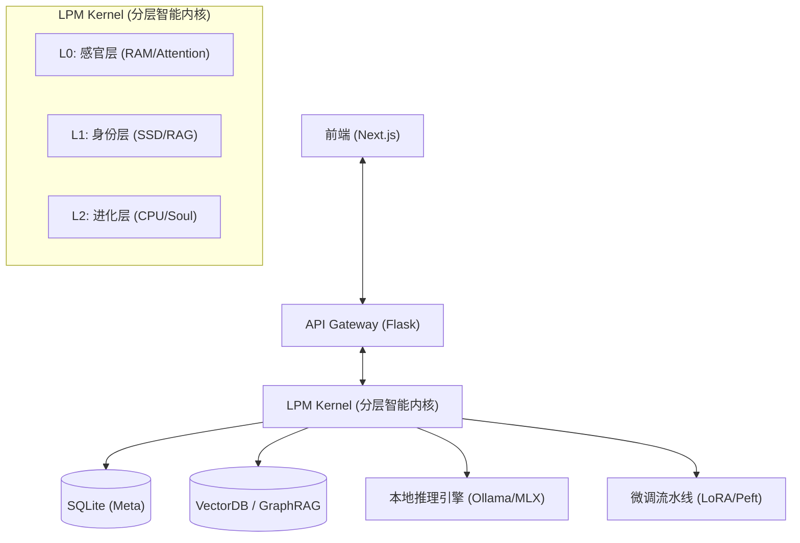

# Second Me 技术架构与实现指南（简化版）

> **Version**: 3.0 Simplified  
> **Role**: Architect View  
> **Status**: Living Document  
> **Last Updated**: 2024  
> **Purpose**: 快速了解产品、架构设计、核心实现

---

## 📚 文档导航

本文档是完整技术文档的简化版本，适合快速了解 Second Me 的核心架构和实现：

- **产品经理/设计师**: 重点关注 [第一部分：产品与设计](#第一部分-产品与设计)
- **架构师**: 重点关注 [第二部分：架构设计](#第二部分-架构设计)
- **开发者**: 重点关注 [第三部分：技术实现](#第三部分-技术实现)

> **注意**: 如需了解详细实现，请参考完整版文档 `TECHNICAL_DESIGN.md`

---

## 目录 (Table of Contents)

### 第一部分：产品与设计 (Product & Design)
1. [项目概述](#1-项目概述-executive-summary)
2. [产品功能规格](#2-产品功能规格-product-specifications)
3. [核心设计理念](#3-核心设计理念-core-design-philosophy)

### 第二部分：架构设计 (Architecture Design)
4. [系统架构设计](#4-系统架构设计-system-architecture)
5. [LPM 智能内核设计](#5-lpm-智能内核设计-lpm-kernel-design)
6. [核心实现机制](#6-核心实现机制-key-implementation-mechanisms)

### 第三部分：技术实现 (Technical Implementation)
7. [数据流转与训练架构](#7-数据流转与训练架构-data--training-pipeline)
8. [在线推理服务架构](#8-在线推理服务架构-online-inference-service)
9. [API 接口与工程结构](#9-api-接口与工程结构-engineering-interface)

---

## 第一部分：产品与设计 (Product & Design)

## 1. 项目概述 (Executive Summary)

**Second Me** 是一个开源的 AI 原生记忆系统，旨在创建一个数字化的"AI 自我"。与传统的简单检索文档的 RAG（检索增强生成）系统不同，Second Me 构建了一个结构化且不断进化的身份模型。它利用 **分层记忆建模 (HMM)** 和 **自我对齐算法 (Me-Alignment)** 来捕捉用户的个性、上下文和思维模式，从而让 AI 能够像用户*一样*思考，而不仅仅是*为*用户思考。

---

## 2. 产品功能规格 (Product Specifications)

### 2.1 核心功能矩阵

| 功能模块 | 核心能力描述 | 用户价值 |
| :--- | :--- | :--- |
| **记忆胶囊 (Memory Capsule)** | 全模态摄入 (文本/图片/音频/文档)，自动生成情感化摘要与深度洞察。支持文件上传和 URL 链接。 | 消除碎片化信息的焦虑，将生活点滴转化为结构化、可检索的知识资产。 |
| **数字分身 (AI Avatar)** | 基于 RAG（L0/L1 检索）+ 微调（L2 训练）的动态人格，随记忆增加而自动进化。 | 获得一个"懂你"的镜像伴侣，提供深度的共情与思维共鸣，而非机械问答。 |
| **思维可视化 (Mind Sphere)** | 3D 动态球体背景动画，提供沉浸式的视觉体验。 | 增强界面的视觉吸引力，营造科技感的用户体验。 |
| **专家协同 (Expert Mode)** | 支持创建自定义角色（Role），每个角色可配置专属的 System Prompt 和知识检索策略。 | 通过角色定制和高级对话模式，提升复杂问题的解决质量。 |
| **自我进化 (Evolution)** | 一键触发 L2 训练循环，将近期的高频记忆内化为模型的直觉。 | 让 AI 越用越聪明，且这种"聪明"是基于用户独特经验的完全定制。 |

### 2.2 典型使用场景

*   **个人知识库管理 (PKM)**: L0 生成摘要 -> L1 聚类主题 -> L2 习得偏好。用户询问技术方案时，AI 能调用过往经验给出符合用户风格的建议。
*   **情感陪伴与反思**: 通过 L0 层的图片情感分类和情感化 Prompt 设计，提供温暖、共情的情绪价值。
*   **创意写作协同**: 利用 **DeepSeek R1** 的思维链能力（CoT）结合 L1 层的用户记忆检索，提供符合用户审美趣味的情节发展建议。

---

## 3. 核心设计理念 (Core Design Philosophy)

### 3.1 设计原则

**1. 本地优先 (Local-First)**
- 数据（向量、权重、日志）全链路本地存储，支持断网运行
- 用户数据完全私有，不上传到云端

**2. 微内核架构 (Micro-Kernel)**
- 核心功能模块化，易于扩展和维护
- 通过插件化机制支持多种 LLM 后端

**3. 分层记忆建模 (HMM)**
- L0: 感官层（短期记忆，RAM）
- L1: 身份层（长期记忆，SSD）
- L2: 进化层（直觉反应，CPU）

### 3.2 技术选型理念

**推理引擎**: 选择 Ollama/llama.cpp 而非云端 API，确保数据隐私和响应速度。

**训练框架**: MLX (Apple Silicon) / PyTorch (CUDA)，支持高效的 LoRA 微调。

---

## 第二部分：架构设计 (Architecture Design)

## 4. 系统架构设计 (System Architecture)

系统遵循 **微内核 (Micro-Kernel)** 与 **本地优先 (Local-First)** 的架构原则。

### 4.1 总体架构图



### 4.2 技术栈选型

*   **前端交互**: Next.js, TailwindCSS, React Context
*   **后端服务**: Python, Flask (Blueprints 模块化), Pydantic
*   **AI 基础设施**:
    *   **推理**: Ollama / llama.cpp (GGUF 适配消费级硬件)
    *   **训练**: MLX (Apple Silicon) / PyTorch (CUDA)
    *   **协议**: Model Context Protocol (MCP)

---

## 5. LPM 智能内核设计 (LPM Kernel Design)

**LPM** = **Language Personal Model**（语言个人模型），是 Second Me 的核心智能内核，负责处理用户的记忆、构建身份模型，并实现 AI 的个性化进化。

内核模仿人类大脑的运作机制，分为三个抽象层级（L0、L1、L2），形成一个从短期记忆到长期记忆再到直觉反应的分层架构。

### 5.1 L0: 感官与洞察层 (Sensory & Insight)

**隐喻**: **System RAM (Short-term Memory)**

**职责**: 处理高频交互，进行原始数据的清洗、分块与洞察提取。

**支持的文件类型**:
- **图片**: JPEG, PNG, GIF, WebP（通过 Vision 模型处理）
- **音频**: MP3, WAV, M4A（通过 Audio 模型处理）
- **文档**: PDF, DOCX, TXT, MD（通过文本处理器处理）
- **链接**: URL 链接（通过链接处理器提取内容）

**核心流程**:
1. **数据分类与预处理**: 根据数据类型选择处理方式，提取用户传记信息（global_bio, status_bio, about_me）
2. **多模态洞察生成**: 
   - **图片**: 情感分类（Emotion/Knowledge）→ 情感化摘要 → 深度洞察
   - **音频**: 概述生成 → 详细分解（含时间戳）
   - **文档**: 个性化摘要 → 主题分解
3. **向量嵌入**: 使用 EmbeddingService 生成文档级嵌入，存储到 ChromaDB `documents` 集合
4. **文档摘要**: 生成标题、摘要和关键词

**输出**: `DocumentDTO`（包含标题、洞察、摘要、关键词、向量嵌入、情感标签）

**存储**: SQLite `document` 表（元数据）+ ChromaDB `documents` 集合（向量）

### 5.2 L1: 身份与结构层 (Identity & Structure)

**隐喻**: **SSD / Hard Drive (Long-term Memory)**

**职责**: 存储结构化事实与经历，构建身份骨架。

**数据结构**:
- `Note`: 记忆原子（从 L0 DocumentDTO 转换，包含 content, embedding, memory_type, insight）
- `Cluster`: 语义聚类（基于向量距离的层次聚类，包含 topic, summary, cluster_center）
- `Shade`: 人格侧影（如 "Python 专家", "科幻爱好者"，包含 name, desc_second_view, confidence）
- `Bio`: 全局传记（整合所有 Shade，包含 global_bio 和 status_bio）

**处理流程**:
1. **生成 Note**: 从 DocumentDTO 转换为 Note，存储到 SQLite `notes` 表
2. **生成 Cluster**: 
   - 使用层次聚类（Ward 方法）将相似 Note 分组
   - 计算 Cluster 中心向量
   - 修剪离群点（保留距离中心最近的 80% 成员）
   - 使用 LLM 生成 Cluster 主题和摘要
3. **生成 Shade**: 
   - 基于 Cluster 使用 LLM 生成人格侧影（初始生成或更新已有 Shade）
   - 应用 Me-Alignment 将第三人称转换为第一人称
   - 计算置信度（基于记忆数量、频率、时效性）
4. **生成 Bio**: 
   - 整合所有 Shade，使用 GLOBAL_BIO_SYSTEM_PROMPT 生成全局描述
   - 使用 StatusBioGenerator 基于最近的 Note、Todo、Chat 生成状态传记

**记忆实体关系**:
```
Bio (1) → (N) Shade → (N) Cluster → (N) Note
```

**存储**: SQLite（notes, l1_clusters, l1_shades, l1_bios 表）

### 5.3 L2: 进化与合成层 (Evolution & Soul)

**隐喻**: **CPU Instruction Set (Intuition)**

**职责**: 将 L1 的显性知识内化为隐性的模型权重 (Weight)。

**特殊机制**: 通过 **SFT + LoRA** 改变模型本身的反应模式，不依赖检索。集成 DeepSeek R1 逻辑，在训练数据中注入 `<think>` 标签，学习用户的思维方式。

**处理流程**:
1. **数据预处理** (`L2DataProcessor`):
   - **按类型分离 Note**: 分为主观（SUBJECTIVE）和客观（OBJECTIVE）
   - **数据精炼**: 使用模板格式化 Note，生成 `processed` 字段
   - **转换为文本格式**: 将 Note 转换为 `.txt` 文件供 GraphRAG 处理
   - **GraphRAG 索引**: 提取实体和关系，构建知识图谱

2. **生成训练数据** (`L2Generator.gen_subjective_data`):
   - **SelfQA**: 基于用户介绍（aboutMe）和全局 Bio 生成自我认知问答（问题列表硬编码，答案通过 LLM 生成）
   - **Preference**: 基于 Cluster（topics.json）生成偏好相关问答（根据数据合成模式采样 Cluster）
   - **Diversity**: 基于 GraphRAG 实体生成多样化问答（问题类型内置，问题内容动态生成）
   - **合并数据**: 将所有 JSON 文件合并为 `merged.json`

3. **数据格式转换**: 转换为 ChatML 格式，应用 Chat Template

4. **训练**: 
   - 使用 SFTTrainer + LoRA（r=8, alpha=16, dropout=0.1）
   - 训练参数：learning_rate=5e-5, num_train_epochs=3, gradient_checkpointing=True
   - 合并 LoRA 权重到基础模型

---

## 6. 核心实现机制 (Key Implementation Mechanisms)

### 6.1 分层记忆建模 (HMM)

建立 **Raw Data -> Note -> Cluster -> Shade -> Bio** 的金字塔结构。查询时自顶向下：先命中 Bio/Shade 确定上下文背景，再下钻到 Cluster/Note 获取精准细节。

### 6.2 自我对齐算法 (Me-Alignment)

AI 产生"自我意识"的关键算法：
1. **客观抽取**: 生成第三人称摘要
2. **视角转换**: 将 "User..." 转换为 "I..."，实现第一人称身份侧影
3. **训练数据生成**: 使用第一人称数据训练 L2 模型

### 6.3 双路检索推理 (Dual-Retrieval Inference)

系统通过 **L0 检索** 和 **L1 检索** 两个通道并行获取知识：
- **L0 检索**: 从 ChromaDB 检索相关文档片段（事实性知识）
- **L1 检索**: 从 Global Bio 检索相关 Shade（身份和偏好）

### 6.4 情感陪伴与反思机制 (Emotional Companion & Reflection)

**实现方式**: 通过 L0 层的多模态处理和情感化 Prompt 设计实现。

**图片情感分类**:
- 使用 Vision 模型将图片分类为 "Emotion" 或 "Knowledge"
- 生成情感化摘要（强调"老朋友"、"温暖"、"共情"、"幽默"）
- 生成多个温暖、共情的洞察点

**文本情感分析**:
- 通过对话时的 L1 检索获取用户相关的记忆和经历
- 通过角色设定，AI 提供无评判的情感支持

### 6.5 创意写作协同机制 (Creative Writing Collaboration)

**实现方式**: 结合 DeepSeek R1 的思维链能力和 L1 层的记忆检索。

**DeepSeek R1 思维链集成**:
- 训练阶段：在训练数据中注入 `<think>` 标签，训练推理能力
- 推理阶段：配置 `thinking_model_name`，调用 DeepSeek R1 模型生成思维链

**用户阅读历史结合**:
- L1 检索用户阅读过的书籍、文章、笔记
- 通过 Shade 识别用户的审美偏好（如"科幻爱好者"、"文学爱好者"）
- 结合检索到的阅读历史和用户的 Shade，生成符合用户审美趣味的情节建议

### 6.6 专家协同机制 (Expert Mode)

**角色系统 (Role System)**:
- **数据模型**: Role 包含 uuid, name, description, system_prompt, enable_l0_retrieval, enable_l1_retrieval
- **实现机制**: 通过 `POST /api/kernel2/roles` 创建角色，在对话请求的 `metadata.role_id` 中指定
- **策略链**: `[BasePromptStrategy, RoleBasedStrategy, KnowledgeEnhancedStrategy]`
- **知识检索控制**: 根据角色的配置动态启用/禁用 L0/L1 检索

**高级对话模式 (Advanced Chat Mode)**:
多阶段处理流程：
1. **Requirement Enhancement**: 使用本地模型澄清模糊意图，集成 L0/L1 知识检索
2. **Expert Solution**: 使用专家模型（通过 UserLLMConfigService 配置，如 GPT-4、Claude）生成解决方案
3. **Validator**: 验证方案是否满足需求，返回 JSON 格式 `{is_valid, feedback}`
4. **Solution Formatter**: 格式化最终输出，提升可读性和结构

**API 端点**: `POST /api/talk/advanced_chat`

---

## 第三部分：技术实现 (Technical Implementation)

## 7. 数据流转与训练架构 (Data & Training Pipeline)

### 7.1 数据模型

L2 训练使用的数据来自 L1 层的结构化记忆，形成一个层次化的数据金字塔：
- **Note**: 记忆原子（主观/客观）
- **Cluster**: 语义聚类（topics.json）
- **Shade**: 人格侧影（第一人称描述）
- **Bio**: 全局传记（整合所有 Shade）

### 7.2 训练状态机 (Training FSM)

训练过程通过状态机管理，确保资源正确分配和流程有序执行：

1. **DataSynthesis**: 数据合成阶段（生成训练数据）
2. **ReleaseVRAM**: 释放显存阶段
3. **LoadModel**: 加载模型阶段
4. **Training**: 训练阶段（SFT + LoRA）
5. **MergeAdapter**: 合并适配器阶段（LoRA 权重合并）
6. **Reload**: 重新加载阶段

**训练参数**:
- LoRA: r=8, alpha=16, dropout=0.1
- 优化器: AdamW, learning_rate=5e-5
- 训练策略: Gradient Checkpointing, Mixed Precision (bf16)

---

## 8. 在线推理服务架构 (Online Inference Service)

基于 `lpm_kernel/api/domains/kernel2`，实现了复杂的 **上下文编排 (Context Orchestration)**。

### 8.1 执行流与时序

1. **Query Analysis**: 解析用户意图（从 `ChatRequest.message` 提取）
2. **Dual Retrieval**: 并行获取 L0 事实与 L1 身份侧影（如果启用检索）
   - L0 检索：从 ChromaDB 检索相关文档片段
   - L1 检索：从 Global Bio 检索相关 Shade
3. **Context Assembly**: 组装增强提示词
   - 基础 System Prompt（`BasePromptStrategy`）
   - 角色 System Prompt（`RoleBasedStrategy`，如果指定角色）
   - 知识增强（`KnowledgeEnhancedStrategy`，如果启用检索）
4. **Streaming Inference**: 调用本地 LLM（Ollama/MLX）或专家模型（Expert Mode）

**高级对话 Prompt 策略流**:
```
Advanced Mode: Requirement Enhancement → Expert Solution → Validator → Solution Formatter → Final Response
Normal Mode: Knowledge Retrieval → Role Injection → Final Response
```

### 8.2 部署策略

*   **Concurrency Control**: 严格的 `Concurrency=1` 队列，防止本地 VRAM 溢出
*   **MCP Integration**: 作为 LLM 与 OS 文件的中间层

### 8.3 核心提示词工程

系统通过精细化的 System Prompts 控制 AI 的认知边界。

**Me-Alignment 视角转换**: 将第三人称描述（如 "User likes Python"）转换为第一人称身份侧影（如 "I like Python"），用于 L2 训练数据生成。

**关键 Prompt**:
- **L0**: `insight_image_overview` - 扮演"老朋友"生成图片标题，建立情感连接
- **L1**: `COMMON_PERSPECTIVE_SHIFT` - 执行第三人称到第一人称的转换
- **L1**: `SHADE_MERGE_PROMPT` - 引导 AI 发现并合并相似的兴趣领域
- **L2**: `CONTEXT_COT_PROMPT` - 在合成数据中注入 `<think>` 标签，训练推理能力
- **Chat**: `RequirementEnhancement` - 在高级对话中扮演"需求分析师"，澄清模糊意图

---

## 9. API 接口与工程结构 (Engineering Interface)

### 9.1 API 规范 (Flask Blueprints)

**核心 API 模块**:

| 模块 | 路由前缀 | 功能描述 | 主要端点 |
| :--- | :--- | :--- | :--- |
| **Kernel2** | `/api/kernel2` | L2 训练控制与对话服务 | `POST /chat`, `POST /train/start` |
| **Documents** | `/api/documents` | L0 洞察触发与管理 | `GET /list`, `POST /scan` |
| **Kernel** | `/api/kernel` | L1 生成与版本管理 | `POST /generate`, `GET /versions` |
| **Space** | `/api/space` | 多智能体协作空间 | `POST /create`, `GET /<space_id>` |
| **Roles** | `/api/kernel2/roles` | 角色定义与管理 | `POST /create`, `GET /all` |
| **TrainProcess** | `/api/trainprocess` | 训练流程控制 | `POST /start`, `GET /progress/<id>` |
| **UserLLMConfig** | `/api/user_llm_config` | LLM 配置管理 | `POST /validate`, `GET /available` |

**API 设计原则**:
- RESTful 风格，使用标准 HTTP 方法
- 统一响应格式：`{code: 0, message: "Success", data: {...}}`
- 流式响应：对话接口支持 Server-Sent Events (SSE)
- DTO 验证：使用 Pydantic 进行请求参数校验

**关键 API 端点**:
- **对话接口** (`POST /api/kernel2/chat`): 支持流式响应，可配置 L0/L1 检索、角色、温度等
- **Space 创建接口** (`POST /api/space/create`): 创建多智能体协作空间

### 9.2 数据模型与数据库 Schema

**核心数据表**:
- `document`: 文档表（L0 输出，包含 title, insight, summary, keywords）
- `notes`: 记忆原子表（L1，包含 content, embedding, memory_type, insight）
- `l1_clusters`: 语义聚类表（包含 topic, summary, cluster_center）
- `l1_shades`: 人格侧影表（包含 name, desc_second_view, confidence）
- `l1_bios`: 全局传记表（包含 global_bio, status_bio）
- `roles`: 角色表（包含 uuid, name, system_prompt, enable_l0_retrieval, enable_l1_retrieval）
- `spaces`: 协作空间表（包含 title, objective, participants, host）

**向量数据库 (ChromaDB)**:
- `documents`: 文档级向量存储
- `document_chunks`: 文档块级向量存储
- 距离度量: Cosine Similarity (`hnsw:space: cosine`)
- 维度: 1536 (默认，支持 OpenAI/自定义 Embedding 模型)
- 持久化: 本地文件系统 (`CHROMA_PERSIST_DIRECTORY`)

### 9.3 项目目录结构

```
Second-Me/
├── lpm_kernel/                    # 后端核心
│   ├── L0/                       # L0 层实现
│   │   ├── l0_generator.py      # L0 生成器
│   │   └── prompt.py             # L0 Prompt 定义
│   ├── L1/                       # L1 层实现
│   │   ├── topics_generator.py   # Cluster 生成
│   │   ├── shade_generator.py   # Shade 生成
│   │   └── bio.py                # Bio 数据模型
│   ├── L2/                       # L2 层实现
│   │   ├── train.py              # 训练脚本
│   │   ├── data.py               # 数据处理器
│   │   └── data_pipeline/       # 数据生成管道
│   ├── api/                      # API 路由
│   │   ├── domains/             # 领域模块
│   │   │   ├── kernel2/        # L2 训练与对话
│   │   │   └── trainprocess/   # 训练流程控制
│   │   └── services/            # 服务层
│   └── common/                   # 公共组件
│       ├── repository/          # 数据访问层
│       └── llm.py               # LLM 客户端抽象
├── lpm_frontend/                 # 前端应用
│   ├── src/app/                 # Next.js App Router
│   └── src/components/          # React 组件
└── docs/                         # 文档
```

### 9.4 前端架构

**技术栈**:
- **框架**: Next.js 14+ (App Router)
- **UI 库**: Ant Design (antd)
- **样式**: TailwindCSS
- **状态管理**: Zustand
- **流式处理**: Server-Sent Events (SSE)

**核心组件**:
- **页面路由**: `/dashboard/playground/chat`（对话界面）、`/dashboard/train/training`（训练管理）
- **状态管理**: `useLoadInfoStore`（负载信息）、`useChatStorage`（对话会话存储）
- **API 代理**: Next.js `rewrites` 将 `/api/*` 请求代理到后端
- **SSE 流式响应**: 使用 `useSSE` Hook 处理流式数据，增量更新 UI

### 9.5 配置管理与部署

**配置管理系统**:
- **单例模式**: `Config` 类从 `.env` 文件加载配置，支持环境变量覆盖
- **用户 LLM 配置**: 支持配置 Chat、Embedding、Thinking（DeepSeek R1）三种模型
- **动态切换**: 支持运行时切换 Embedding 模型，自动检测维度并重建 ChromaDB Collection

**部署架构**:
- **Docker Compose**: 支持后端和前端服务容器化部署
- **多平台支持**: Dockerfile 变体支持通用 Linux、Apple Silicon、CUDA GPU
- **数据持久化**: Volume 挂载 `./data`（SQLite、ChromaDB、日志）、`./resources`（训练数据、模型文件）

**性能优化**:
- **推理优化**: 并发控制（Concurrency=1）、模型量化（4bit/8bit）、延迟加载
- **向量检索优化**: 批量处理、ChromaDB HNSW 索引自动优化
- **前端优化**: SSE 流式渲染、API 代理缓存

**安全与隐私**:
- **数据隔离**: 多实例支持，每个实例独立数据库
- **本地优先**: 所有数据本地存储，支持完全离线运行

---

## 附录 A: 关键术语表 (Glossary)

| 术语 | 英文 | 定义 |
| :--- | :--- | :--- |
| **LPM** | Language Personal Model | 语言个人模型，Second Me 的核心智能内核 |
| **HMM** | Hierarchical Memory Modeling | 分层记忆建模，从 Raw Data 到 Bio 的金字塔结构 |
| **Me-Alignment** | Me-Alignment Algorithm | 自我对齐算法，将第三人称转换为第一人称 |
| **Shade** | Shade | 人格侧影，基于 Cluster 生成的身份特征 |
| **Cluster** | Cluster | 语义聚类，基于向量距离分组的 Note 集合 |
| **Note** | Note | 记忆原子，最小的记忆单元 |
| **Bio** | Biography | 全局传记，整合所有 Shade 的用户画像 |
| **LoRA** | Low-Rank Adaptation | 低秩适应，高效的模型微调技术 |
| **CoT** | Chain of Thought | 思维链，一种让 AI 展示推理过程的技术 |
| **GraphRAG** | Graph Retrieval-Augmented Generation | 图检索增强生成，使用知识图谱增强 RAG |
| **MCP** | Model Context Protocol | 模型上下文协议，用于 LLM 与工具/环境的交互 |

---

**文档维护**: 本文档是完整技术文档的简化版本，减少了约 30%+ 的内容，专注于核心架构和关键实现。如需了解详细实现、代码示例和数据格式，请参考完整版文档 `TECHNICAL_DESIGN.md`。

---

## 附录 A: 关键术语表 (Glossary)

| 术语 | 英文 | 定义 |
| :--- | :--- | :--- |
| **LPM** | Language Personal Model | 语言个人模型，Second Me 的核心智能内核 |
| **HMM** | Hierarchical Memory Modeling | 分层记忆建模，从 Raw Data 到 Bio 的金字塔结构 |
| **Me-Alignment** | Me-Alignment Algorithm | 自我对齐算法，将第三人称转换为第一人称 |
| **Shade** | Shade | 人格侧影，基于 Cluster 生成的身份特征 |
| **Cluster** | Cluster | 语义聚类，基于向量距离分组的 Note 集合 |
| **Note** | Note | 记忆原子，最小的记忆单元 |
| **Bio** | Biography | 全局传记，整合所有 Shade 的用户画像 |
| **LoRA** | Low-Rank Adaptation | 低秩适应，高效的模型微调技术 |
| **CoT** | Chain of Thought | 思维链，一种让 AI 展示推理过程的技术 |

---

**文档维护**: 本文档是完整技术文档的简化版本，如需了解详细实现，请参考 `TECHNICAL_DESIGN.md`。

